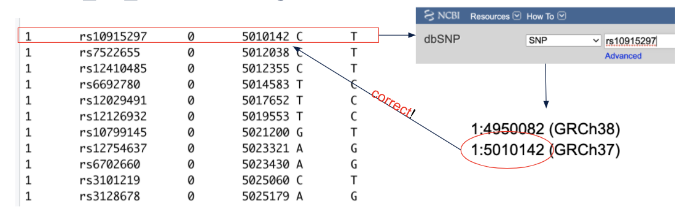

# Introduction

While this tutorial is intended to be as robust as possible, there are some additional processes and considerations that may be needed for individual datasets. This section serves to provide examples of when and how to incorportant various tools and commands that were not necessary for our example HapMap dataset, but are likely to come up in other analyses. 

## Liftover

!!! note
    This section is neccessary when the build of your own dataset is different from the reference set used for annotation or population stratification anchoring. While the update-map tool can be used (as demonstrated in the Population Stratification section),  Liftover is also useful when performing a meta-analysis to ensure all individual datasets are in the same build prior to combining summary statistics. The commands outlined here will provide an example for downloading Liftover and neccessary associated files to convert a data set from build hg38 to hg19. 

You can install Liftover and its dependencies with the following commands:

```bash
wget http://hgdownload.soe.ucsc.edu/admin/exe/linux.x86_64/liftOver
##replace the following chain file to match your desired build conversion
wget https://hgdownload.soe.ucsc.edu/goldenPath/hg38/liftOver/hg38ToHg19.over.chain.gz
wget https://raw.githubusercontent.com/Shicheng-Guo/GscPythonUtility/master/liftOverPlink.py
chmod +x liftOverPlink.py
chmod +x liftOver
```

Once you have downloaded the necessary filesets and changed the permissions to facilitate running the python code you can declare your starting fileset: 
```bash 
fileset=startingfileset
```

Next you need to change from space delimiter to tab delimiter with the '--recode tab' handle.  

```bash
plink --bfile $fileset --recode tab --out $fileset.tab
```

Finally, you can run liftover to change your fileset build and then convert back to plink format. 

```bash 
./liftOverPlink.py -m $fileset.tab.map -p  $fileset.tab.ped -o $fileset.hg19 -c hg38ToHg19.over.chain.gz -e ./liftOver
plink --ped $fileset.hg19.ped --map $fileset.hg19.map --make-bed --out $fileset.final.hg19
```

To confirm your file was appropriately lifted over, it is good practice to choose a few snps from your bim file and confirm on [dbgap](https://www.ncbi.nlm.nih.gov/gap/) whether your snpid appropriately matches with the corresponding chr:bp positions presented. 



Here, we see we appropriately lifted-over to build hg19 (GRCh37)


## Imputation

## Meta-Analysis using METAL software

## Separated by Chromosome

Here, we demonstrate how to perform population stratification using the much larger updated 1000 Genomes data set that is separated by chromosome. The steps here are not only useful for the purpose of population stratification but also to teach users how to handle any data set separated by chromosome (common for large datasets)

First, we can download the data set using a *wget* command:

```bash
gr=_GRCh38
for chr in {1..22}; do \
wget http://ftp.1000genomes.ebi.ac.uk/vol1/ftp/release/20130502/supporting/GRCh38_positions/ALL.chr$chr$gr.genotypes.20170504.vcf.gz
wget http://ftp.1000genomes.ebi.ac.uk/vol1/ftp/release/20130502/supporting/GRCh38_positions/ALL.chr$chr$gr.genotypes.20170504.vcf.gz.tbi
done  
```
This loop takes a long time to run. You may want to let it sit over night if you have the option to. 


## Cluster computing

## Admixture 