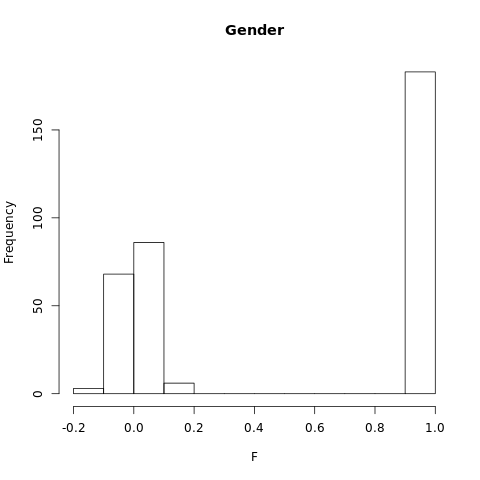
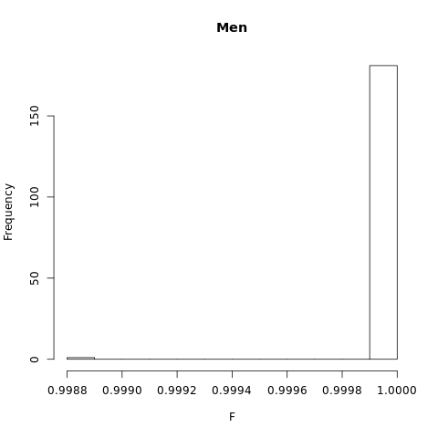
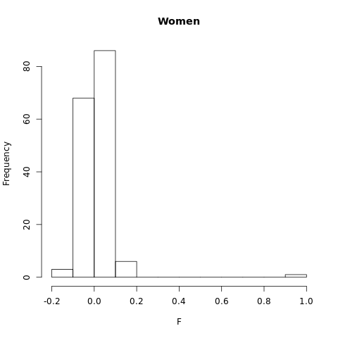

# QC of HapMap3 data

In this tutorial, you will learn how to perform all quality control steps that one typically takes before analyzing their genetic data further. The tutorial is based on `insert download link for code`. This code-file forms a pipeline that performs all quality control steps taken here in tandem. The code can easily be adjusted such that it works with any genetic dataset, and is a good starting point to perform your own analyses. 

!!! note
    You will need `plink` in this section, which can be download from [here](https://www.cog-genomics.org/plink/1.9/).

    Install the program `plink` and include its location in your PATH directory, which allows us to use `plink` instead of `./plink` in the commands below. If PLINK is not in your PATH directory and is instead in your working directory, replace all instances of `plink` in the tutorial with `./plink`.

##Obtaining HapMap data
The first step in GWAS analyses is to generate or obtain the genotype or sequencing data. In this tutorial, we will store this data in binary PLINK format. Binary PLINK datasets consist of three corresponding files: *.bim, *.bed, and *.fam. A *.fam file contains information on the individuals in the dataset, whereas the *.bim file contains information on the genetic markers that are included. The *.bed file is typically the largest and contains the genotypes. As it is written in binary, it is not in readable format for humans.

You can download the HapMap example data [here](https://drive.google.com/drive/folders/1TNRwAxWx_itjjt3dbtsR0CrUgkKk5yxw?usp=sharing) 

## Reading the genotype data file:
We will set a **FILESET** variable to refer to our raw genotype datafile throughout this tutorial. This makes it easier to adjust the code used here for analyses on your own data, as you only need to change the **FILESET** variable towards the name of your own datafile, provided that it is stored in the .bim/.bed/.fam format. Next, we will set our working directory towards the directory in which we have stored the HapMap data. Furthermore, ensure that the PLINK application is in your working directory. You can use the bash command **ls** to check whether your working directory holds all the necessary files.  

```bash
FILESET=HapMap_3_r3_1
cd HOME/{user}/{path/folder containing your files}
ls 
```

??? note "Check whether all files are stored in your working directory:"
      
      ```bash
      $ ls
      HapMap_3_r3_1.bed  HapMap_3_r3_1.bim  HapMap_3_r3_1.fam  plink
      ```

Before we start performing QC on the HapMap data, ensure that you familiarize yourself with the format in which the datafiles are stored. Use the **head** command to see the beginning of a file.

```bash
head HapMap_3_r3_1.fam
head HapMap_3_r3_1.bim
```

??? note "This results in the following output:"
      
      ```bash
      $ head HapMap_3_r3_1.fam
      1328 NA06989 0 0 2 2
      1377 NA11891 0 0 1 2
      1349 NA11843 0 0 1 1
      1330 NA12341 0 0 2 2
      1444 NA12739 NA12748 NA12749 1 -9
      1344 NA10850 0 NA12058 2 -9
      1328 NA06984 0 0 1 2
      1463 NA12877 NA12889 NA12890 1 -9
      1418 NA12275 0 0 2 1
      13291 NA06986 0 0 1 1

      $ head HapMap_3_r3_1.bim
      1       rs2185539       0       556738  T       C
      1       rs11510103      0       557616  G       A
      1       rs11240767      0       718814  T       C
      1       rs3131972       0       742584  A       G
      1       rs3131969       0       744045  A       G  
      1       rs1048488       0       750775  C       T
      1       rs12562034      0       758311  A       G
      1       rs12124819      0       766409  G       A
      1       rs4040617       0       769185  G       A
      1       rs2905036       0       782343  C       T
      ```

These files have no headers but are always structured the same. The structure of a .fam file is as follows:

- **Column 1** contains the family id
- **Column 2** contains the Within-family id
- **Column 3** contains the Within-family id of the father ('0' if the father is not included in the data)
- **Column 4** contains the Within-family id of the mother ('0' if the mother is not included in the data)
- **Column 5** contains the individual's sex ('1' for male, '2' for female '0' if unknown)
- **Column 6** contains the value of the phenotype ('1' for cases, '2' for controls. Missing data points are often stored as '-9', '0', or a non-numeric character)

The structure of a .bim file is as follows:
 
- **Column 1** contains the chromosome code (integer, 'X'/'Y'/'XY'/'MT', or '0' if unknown), or the chromosome name
- **Column 2** contains the identifier of the genetic variant
- **Column 3** contains the position in morgans or centimorgans, but this value is usually set to '0'.
- **Column 4** contains the base-pair coordinate.
- **Column 5** contains the reference allele (Allele 1), which is usually the minor allele.
- **Column 6** contains the alternative allele (Allele 2), which is usually the major allele.

One could run the command **head HapMap_3_r3_1.bed** as well, but this would result in gibberish: the .bed file is not legible to humans.

## Visualizing and correcting for missingness
As a first step in our QC, we evoke PLINK to produce SNP and individual missingness data. The **plink** command in bash will start the PLINK program. The option **-bfile** is used to read the data (in binary PLINK format), the option **--missing** creates a **plink.imiss** and **plink.lmiss** output file with the individual and SNP missingness data, respectively.   

```bash
plink -bfile $FILESET --missing
```

??? note "PLINK gives us the following output:" 

      ```bash
      PLINK v1.90b6.17 64-bit (28 Apr 2020)          www.cog-genomics.org/plink/1.9/
      (C) 2005-2020 Shaun Purcell, Christopher Chang   GNU General Public License v3
      Logging to plink.log.
      Options in effect:
        --bfile HapMap_3_r3_1
        --missing

      12574 MB RAM detected; reserving 6287 MB for main workspace.
      1457897 variants loaded from .bim file.
      165 people (80 males, 85 females) loaded from .fam.
      112 phenotype values loaded from .fam.
      Using 1 thread (no multithreaded calculations invoked).
      Before main variant filters, 112 founders and 53 nonfounders present.
      Calculating allele frequencies... done.
      Warning: 225 het. haploid genotypes present (see plink.hh ); many commands
      treat these as missing. 
      Total genotyping rate is 0.997378.
      --missing: Sample missing data report written to plink.imiss, and variant-based
      missing data report written to plink.lmiss.
      ```


??? note "Inspect plink.imiss and plink.lmiss"
      
      ```bash 
      head plink.imiss

      FID       IID MISS_PHENO   N_MISS   N_GENO   F_MISS
      1328   NA06989          N     4203  1457897 0.002883
      1377   NA11891          N    20787  1457897  0.01426
      1349   NA11843          N     1564  1457897 0.001073
      1330   NA12341          N     6218  1457897 0.004265
      1444   NA12739          Y    29584  1457897  0.02029
      1344   NA10850          Y     2631  1457897 0.001805
      1328   NA06984          N     9638  1457897 0.006611
      1463   NA12877          Y     3788  1457897 0.002598
      1418   NA12275          N     5349  1457897 0.003669
      ```
   
      The column headers correspond to the following: 

      - **FID**: Family ID
      - **IID**: Individual ID
      - **MISS_PHENO**:  Missing phenotype? (Y/N)
      - **N_MISS**: Number of missing SNPs
      - **N_GENO**: Number of non-obligatory missing genotypes
      - **F_MISS**: Proportion of missing SNPs

      ```bash
      head plink.lmiss
      CHR         SNP   N_MISS   N_GENO   F_MISS
      1   rs2185539        0      165        0
      1  rs11510103        4      165  0.02424
      1  rs11240767        0      165        0
      1   rs3131972        0      165        0
      1   rs3131969        0      165        0
      1   rs1048488        1      165 0.006061
      1  rs12562034        0      165        0
      1  rs12124819        1      165 0.006061
      1   rs4040617        0      165        0
      ```

      The column headers correspond to the following: 

      - **CHR**: Chromosome
      - **SNP**: SNP rsID
      - **N_MISS**:  Number of individuals for which this SNP is missing
      - **N_GENO**: Number of non-obligatory missing genotypes
      - **F_MISS**: Proportion of sample missing for this SNP

### Generate Histogram to view missingness. 

To summarize the extent of missing data, we load both files into R, and generate histograms to visualize the proportion of missingness in the data, per individual and per SNP, respectively.

=== "Performed in R"
Rsc
```{r}
indmiss<-read.table(file="plink.imiss", header=TRUE)
snpmiss<-read.table(file="plink.lmiss", header=TRUE)
# read data into R 

png("histimiss.png") #indicates png format and gives title to file
hist(indmiss[,6],main="Histogram individual missingness") #selects column 6, names header of file
dev.off()

png("histlmiss.png")
hist(snpmiss[,5],main="Histogram SNP missingness")  
dev.off() # shuts down the current device
```


 
Most individuals have next to no missing SNP data, although some individuals have missing data at 2% or even more of all SNP loci. Similarily, most SNPs are available in virtually all individuals in our dataset, although some SNPs are missing with considerable frequency, i.e. in 2% or even up to 5% of all individuals.

### Filter on missingness

As a first step of the quality control process, we will drop SNPs that are missing with considerable frequency from our data. Furthermore, we will drop individuals who frequently have missing genotype calls.

We begin with defining our starting filter values. We recommend a missing genotype threshold of 2% (MIND) for each individual, as well as a missingness threshold of 2% (GENO) for each SNP. Again, defining these values as a seperate variable makes them easier to change when using this code for different analyses.

```bash
GENO=0.02 
MIND=0.02 
```
In the following plink commands, the **--make-bed** flag instructs plink to convert the data back into the PLINK binary format after the filtering has been performed. The **--out** flag is used to name the resulting output file. It is **important** to filter on SNP missingness (**--geno**) prior to filtering on individual missingness (**--mind**). Furtermore, we recommend to filter for missingness in two steps: once with a very lenient missingness threshold (i.e. 20%), and next with the missingness threshold you set (i.e. 2%). This two-step approach shields you from bad scenarios where, for example, many SNPs would fall above the missingness threshold if a subset of individuals have extremely high rates of missingness. Note, however, that most high quality genetic datasets should not have any SNPs or individuals with missingness >20%, and if this is the case, it should give reason to worry about whether the data was pre-processed correctly.

```bash
plink --bfile $FILESET --geno 0.2 --make-bed --out $FILESET.geno.temp
plink --bfile $FILESET.geno.temp --mind 0.2 --make-bed --out $FILESET.mind.temp
plink --bfile $FILESET.mind.temp --geno $GENO --make-bed --out $FILESET.geno
plink --bfile $FILESET.geno --mind $MIND --make-bed --out $FILESET.mind
```

??? note "This results in the following output:"

      ```bash
      $ plink --bfile $FILESET --geno 0.2 --make-bed --out $FILESET.geno.temp
      PLINK v1.90b6.17 64-bit (28 Apr 2020)          www.cog-genomics.org/plink/1.9/
      (C) 2005-2020 Shaun Purcell, Christopher Chang   GNU General Public License v3
      Logging to HapMap_3_r3_1.geno.temp.log.
      Options in effect:
        --bfile HapMap_3_r3_1
        --geno 0.2
        --make-bed
        --out HapMap_3_r3_1.geno.temp

      12574 MB RAM detected; reserving 6287 MB for main workspace.
      1457897 variants loaded from .bim file.
      165 people (80 males, 85 females) loaded from .fam.
      112 phenotype values loaded from .fam.
      Using 1 thread (no multithreaded calculations invoked).
      Before main variant filters, 112 founders and 53 nonfounders present.
      Calculating allele frequencies... done.
      Warning: 225 het. haploid genotypes present (see HapMap_3_r3_1.geno.temp.hh );
      many commands treat these as missing.
      Total genotyping rate is 0.997378.
      0 variants removed due to missing genotype data (--geno).
      1457897 variants and 165 people pass filters and QC.
      Among remaining phenotypes, 56 are cases and 56 are controls.  (53 phenotypes
      are missing.)
      --make-bed to HapMap_3_r3_1.geno.temp.bed + HapMap_3_r3_1.geno.temp.bim +
      HapMap_3_r3_1.geno.temp.fam ... done.
      
      $plink --bfile $FILESET.geno.temp --mind 0.2 --make-bed --out $FILESET.mind.temp
      PLINK v1.90b6.17 64-bit (28 Apr 2020)          www.cog-genomics.org/plink/1.9/
      (C) 2005-2020 Shaun Purcell, Christopher Chang   GNU General Public License v3
      Logging to HapMap_3_r3_1.mind.temp.log.
      Options in effect:
        --bfile HapMap_3_r3_1.geno.temp
        --make-bed
        --mind 0.2
        --out HapMap_3_r3_1.mind.temp

      12574 MB RAM detected; reserving 6287 MB for main workspace.
      1457897 variants loaded from .bim file.
      165 people (80 males, 85 females) loaded from .fam.
      112 phenotype values loaded from .fam.
      0 people removed due to missing genotype data (--mind).
      Using 1 thread (no multithreaded calculations invoked).
      Before main variant filters, 112 founders and 53 nonfounders present.
      Calculating allele frequencies... done.
      Warning: 225 het. haploid genotypes present (see HapMap_3_r3_1.mind.temp.hh );
      many commands treat these as missing.
      Total genotyping rate is 0.997378.
      1457897 variants and 165 people pass filters and QC.
      Among remaining phenotypes, 56 are cases and 56 are controls.  (53 phenotypes
      are missing.)
      --make-bed to HapMap_3_r3_1.mind.temp.bed + HapMap_3_r3_1.mind.temp.bim +
      HapMap_3_r3_1.mind.temp.fam ... done.
      $ plink         --bfile $FILESET.mind.temp --geno $GENO --make-bed --out $FILESET.geno
      PLINK v1.90b6.17 64-bit (28 Apr 2020)          www.cog-genomics.org/plink/1.9/
      (C) 2005-2020 Shaun Purcell, Christopher Chang   GNU General Public License v3
      Logging to HapMap_3_r3_1.geno.log.
      Options in effect:
        --bfile HapMap_3_r3_1.mind.temp
        --geno 0.02
        --make-bed
        --out HapMap_3_r3_1.geno
      
      12574 MB RAM detected; reserving 6287 MB for main workspace.
      1457897 variants loaded from .bim file.
      165 people (80 males, 85 females) loaded from .fam.
      112 phenotype values loaded from .fam. 
      Using 1 thread (no multithreaded calculations invoked).
      Before main variant filters, 112 founders and 53 nonfounders present.
      Calculating allele frequencies... done.
      Warning: 225 het. haploid genotypes present (see HapMap_3_r3_1.geno.hh ); many
      commands treat these as missing.
      Total genotyping rate is 0.997378.
      27454 variants removed due to missing genotype data (--geno).
      1430443 variants and 165 people pass filters and QC.
      Among remaining phenotypes, 56 are cases and 56 are controls.  (53 phenotypes
      are missing.)
      --make-bed to HapMap_3_r3_1.geno.bed + HapMap_3_r3_1.geno.bim +
      HapMap_3_r3_1.geno.fam ... done.
      
      $ plink --bfile $FILESET.geno --mind $MIND --make-bed --out $FILESET.mind
      PLINK v1.90b6.17 64-bit (28 Apr 2020)          www.cog-genomics.org/plink/1.9/
      (C) 2005-2020 Shaun Purcell, Christopher Chang   GNU General Public License v3
      Logging to HapMap_3_r3_1.mind.log.
      Options in effect:
        --bfile HapMap_3_r3_1.geno
        --make-bed
        --mind 0.02
        --out HapMap_3_r3_1.mind
      
      12574 MB RAM detected; reserving 6287 MB for main workspace.
      1430443 variants loaded from .bim file.
      165 people (80 males, 85 females) loaded from .fam.
      112 phenotype values loaded from .fam.
      0 people removed due to missing genotype data (--mind).
      Using 1 thread (no multithreaded calculations invoked).
      Before main variant filters, 112 founders and 53 nonfounders present.
      Calculating allele frequencies... done.
      Warning: 179 het. haploid genotypes present (see HapMap_3_r3_1.mind.hh ); many
      commands treat these as missing.
      Total genotyping rate is 0.997899.
      1430443 variants and 165 people pass filters and QC.
      Among remaining phenotypes, 56 are cases and 56 are controls.  (53 phenotypes
      are missing.)
      --make-bed to HapMap_3_r3_1.mind.bed + HapMap_3_r3_1.mind.bim +
      HapMap_3_r3_1.mind.fam ... done.
      ``` 

As expected, In the first step, 0 variants and 0 individuals were removed from the data. When subsequently filtering on the stricter threshold of 0.02, 27454 SNPs were removed from the data, leaving 1430443 SNPs. Finally, 0 people were removed due to missing genotype data, leaving 165 individuals. 

## Check for Sex Discrepancies

We check whether each individual's assigned sex corresponds with their genotype. The **--check-sex** flag in PLINK tests this by calculating X chromosome homozygosity. Males should have an X chromosome homozygosity estimate >0.8. Females should have a value < 0.2. Subjects who do not fulfill these requirements are flagged as a "PROBLEM" by PLINK.

!!! note
      The **--check-sex** flag supposes that the x chromosome has been split. This means that in the .bim file you           should    see SNPs assigned to a 25th chromosome. This chromosome represents the SNPs lying on the                     pseudoautosomal region of the X chromosome. If you have not already done so, YOU MUST use the **--split-x** flag       to seperate the pseudoautosomal region in this fashion.

First, we want to visualize the F-values and check for discrepencies.
```bash
plink --bfile $FILESET.mind --check-sex 
```

??? note "This results in the following output:"

      ```bash 
      PLINK v1.90b6.17 64-bit (28 Apr 2020)          www.cog-genomics.org/plink/1.9/
      (C) 2005-2020 Shaun Purcell, Christopher Chang   GNU General Public License v3
      Logging to plink.log.
      Options in effect:
        --bfile HapMap_3_r3_1.mind
        --check-sex

      12574 MB RAM detected; reserving 6287 MB for main workspace.
      1430443 variants loaded from .bim file.
      165 people (80 males, 85 females) loaded from .fam.
      112 phenotype values loaded from .fam.
      Using 1 thread (no multithreaded calculations invoked).
      Before main variant filters, 112 founders and 53 nonfounders present.
      Calculating allele frequencies... done.
      Warning: 179 het. haploid genotypes present (see plink.hh ); many commands
      treat these as missing.
      Total genotyping rate is 0.997899.
      1430443 variants and 165 people pass filters and QC.
      Among remaining phenotypes, 56 are cases and 56 are controls.  (53 phenotypes
      are missing.)
      --check-sex: 23424 Xchr and 0 Ychr variant(s) scanned, 1 problem detected.
      Report written to plink.sexcheck .
      ```

      Plink reports that one individual has a different sex as determined by the X chromosome, compared to sex assigned in the pedigree file.

??? note "Inspect plink.sexcheck:"


      ```bash
      head plink.sexcheck
          FID       IID       PEDSEX       SNPSEX       STATUS            F
         1328   NA06989            2            2           OK     -0.01184
         1377   NA11891            1            1           OK            1
         1349   NA11843            1            1           OK            1
         1330   NA12341            2            2           OK     -0.01252
         1444   NA12739            1            1           OK            1
         1344   NA10850            2            2           OK      0.01496
         1328   NA06984            1            1           OK            1
         1463   NA12877            1            1           OK            1
         1418   NA12275            2            2           OK      -0.1028
      ```

      The column headers correspond to the following 
      
      - **FID**:     Family ID
      - **IID**:     Individual ID
      - **PEDSEX**:  Sex as determined in pedigree file (1=male, 2=female)
      - **SNPSEX**:  Sex as determined by X chromosome
      - **STATUS**:  Displays "PROBLEM" or "OK" for each individual
      - **F**:       The actual X chromosome inbreeding (homozygosity) estimate

We now visualize the estimated X chromosome homozygosity for assigned males and females in R:

=== "Performed in R"
```{r}
gender <- read.table("plink.sexcheck", header=T,as.is=T)

png("Gender_check.png")
hist(gender[,6],main="Gender", xlab="F")
dev.off()

png("Men_check.png")
male=subset(gender, gender$PEDSEX==1)
hist(male[,6],main="Men",xlab="F")
dev.off()

png("Women_check.png")
female=subset(gender, gender$PEDSEX==2)
hist(female[,6],main="Women",xlab="F")
dev.off()
```




  
The third histogram shows where the problem lies: one individual is marked as female in the pedigree file, but is male according to the X chromosome. PLINK has marked this case as ``PROBLEM'' in column 5 of plink.sexcheck. We will use grep and awk to print the FID and IID of this person, and remove this person from our data using the **--remove** flag in PLINK.

```bash
grep "PROBLEM" plink.sexcheck| awk '{print$1,$2}'> sex_discrepancy.txt
plink --bfile $FILESET.mind --remove sex_discrepancy.txt --make-bed --out $FILESET.rem
```

## Limit data to autosomal SNPs only 

Most genetic analysis focuses solely on autosomal SNPs, ignoring the sex chromosome or mitochondrial DNA. We will use the **--extract** flag in PLINK to extract only such SNPs. Before using this flag, we will generate a list of RSids that lie on the autosome (chromosome 1-22), using the awk command. 

```bash
awk '{ if ($1 >= 1 && $1 <= 22) print $2 }' $FILESET.rem.bim > snp_1_22.txt
plink --bfile $FILESET.rem --extract snp_1_22.txt --make-bed --out $FILESET.autosome
```
## Perform MAF check and filter by MAF Threshold
Next, we will check the minor allele frequency (MAF) of each SNP. SNPs with a low MAF are rare. As a result, power to detect their associations with a given phenotype is low. Furthermore, such SNPs are more prone to genotyping errors. The **--freq** flag in PLINK is used to calculate MAFs. 


```bash
plink --bfile $FILESET.autosome --freq --out MAF_check
```

??? note "PLINK reports the following output: "

      ```bash
      $ plink --bfile $FILESET.rem --extract snp_1_22.txt --make-bed --out $FILESET.autosome
      PLINK v1.90b6.17 64-bit (28 Apr 2020)          www.cog-genomics.org/plink/1.9/
      (C) 2005-2020 Shaun Purcell, Christopher Chang   GNU General Public License v3
      Logging to HapMap_3_r3_1.autosome.log.
      Options in effect:
        --bfile HapMap_3_r3_1.rem
        --extract snp_1_22.txt
        --make-bed
        --out HapMap_3_r3_1.autosome

      12574 MB RAM detected; reserving 6287 MB for main workspace.
      1430443 variants loaded from .bim file.
      164 people (80 males, 84 females) loaded from .fam.
      112 phenotype values loaded from .fam.
      --extract: 1398544 variants remaining.
      Using 1 thread (no multithreaded calculations invoked).
      Before main variant filters, 112 founders and 52 nonfounders present.
      Calculating allele frequencies... done.
      Total genotyping rate is 0.998052.
      1398544 variants and 164 people pass filters and QC.
      Among remaining phenotypes, 56 are cases and 56 are controls.  (52 phenotypes
      are missing.)
      --make-bed to HapMap_3_r3_1.autosome.bed + HapMap_3_r3_1.autosome.bim +
      HapMap_3_r3_1.autosome.fam ... done.
      ```
This creates the file MAF_check.frq. 

??? note "Inspect MAF_check.frq:"

      ```bash
      head MAF_check.frq
       CHR         SNP   A1   A2          MAF  NCHROBS
         1   rs2185539    T    C            0      224
         1  rs11240767    T    C            0      224
         1   rs3131972    A    G       0.1652      224
         1   rs3131969    A    G       0.1339      224
         1   rs1048488    C    T       0.1667      222
         1  rs12562034    A    G       0.1027      224
         1  rs12124819    G    A       0.2902      224
         1   rs4040617    G    A       0.1295      224
         1   rs2905036    C    T            0      224
      ```
Again, use R to visualize the MAF distribution.

=== "Performed in R"
```{r}
maf_freq <- read.table("MAF_check.frq", header =TRUE, as.is=T)
png("MAF_distribution.png")
hist(maf_freq[,5],main = "MAF distribution", xlab = "MAF")
dev.off()
```


Now, we want to filter any SNPs with a low MAF. The larger your dataset, the higher your power, such that you can set a less conservative MAF threshold. We recommend to throw out all SNPs with MAF < 0.05 for a small data set such as the current one. For a larger dataset `What is larger?`, this threshold can be relaxed to 0.01.

The **--maf** flag in PLINK filters out SNPs that fall below the given threshold.

```bash
MAF=0.05
plink --bfile $FILESET.autosome --maf $MAF --make-bed --out $FILESET.maf
```

??? note "PLINK reports the following output: "

    ```bash
    $ plink --bfile $FILESET.autosome --maf $MAF --make-bed --out $FILESET.maf
    PLINK v1.90b6.17 64-bit (28 Apr 2020)          www.cog-genomics.org/plink/1.9/
    (C) 2005-2020 Shaun Purcell, Christopher Chang   GNU General Public License v3
    Logging to HapMap_3_r3_1.maf.log.
    Options in effect:
      --bfile HapMap_3_r3_1.autosome
      --maf 0.05
      --make-bed
      --out HapMap_3_r3_1.maf

    12574 MB RAM detected; reserving 6287 MB for main workspace.
    1398544 variants loaded from .bim file.
    164 people (80 males, 84 females) loaded from .fam.
    112 phenotype values loaded from .fam.
    Using 1 thread (no multithreaded calculations invoked).
    Before main variant filters, 112 founders and 52 nonfounders present.
    Calculating allele frequencies... done.
    Total genotyping rate is 0.998052.
    325318 variants removed due to minor allele threshold(s)
    (--maf/--max-maf/--mac/--max-mac).
    1073226 variants and 164 people pass filters and QC.
    Among remaining phenotypes, 56 are cases and 56 are controls.  (52 phenotypes
    are missing.)
    --make-bed to HapMap_3_r3_1.maf.bed + HapMap_3_r3_1.maf.bim +
    HapMap_3_r3_1.maf.fam ... done
      ``` 
    

PLINK removed 325,318 SNPs, leaving 1,073,226 variants.

## View heterozygosity distribution and remove outliers 
We next check heterozygosity rates for all individuals within the sample. Excessively high or low heterozygosity rates could indicate sample contamination or inbreeding. 

### Generate a pruned subset of SNPs that are in approximate linkage equilibrium.
Heterozygosity must be computed in a set of independent SNPs. SNPs that are in linkage disequilibrium violate the independence assumption. Hence, we perform a procedure called ``variant pruning'' to reduce our dataset towards a set of SNPs that are in approximate linkage equilibrium with one another. The **--indep-pairwise** flag in PLINK performs the pruning procedure. Its syntax is --indep-pairwise <window size>['kb'] <step size (variant ct)> <r^2 threshold>. Within each window, PLINK computes the pairwise r^2 between each SNP, removes one of the SNPs (the one with the lowest MAF) if the pairwise r^2 is larger than the r^2 threshold, and repeats until no SNPs within the window have an r^2 above the given threshold. The algorithm will then shift its window, as given by the step size argument, and repeat. We recommend to set a window of 50kb, a step size of 5, and an r^2 threshold of 0.5.  

```bash
plink --bfile $FILESET.maf --indep-pairwise 50 5 0.5
```

??? note "PLINK reports the following output: "

    ```bash
    plink --bfile $FILESET.maf --indep-pairwise 50 5 0.5
    PLINK v1.90b6.17 64-bit (28 Apr 2020)          www.cog-genomics.org/plink/1.9/
    (C) 2005-2020 Shaun Purcell, Christopher Chang   GNU General Public License v3  
    Logging to plink.log.
    Options in effect:
      --bfile HapMap_3_r3_1.maf
      --indep-pairwise 50 5 0.5

    12574 MB RAM detected; reserving 6287 MB for main workspace.
    1073226 variants loaded from .bim file.
    164 people (80 males, 84 females) loaded from .fam.
    112 phenotype values loaded from .fam.
    Using 1 thread (no multithreaded calculations invoked).
    Before main variant filters, 112 founders and 52 nonfounders present.
    Calculating allele frequencies... done.
    Total genotyping rate is 0.998039.
    1073226 variants and 164 people pass filters and QC.
    Among remaining phenotypes, 56 are cases and 56 are controls.  (52 phenotypes
    are missing.)
    Pruned 67124 variants from chromosome 1, leaving 20596.
    Pruned 69461 variants from chromosome 2, leaving 20337.
    Pruned 57330 variants from chromosome 3, leaving 17532.
    Pruned 50485 variants from chromosome 4, leaving 15644.
    Pruned 52786 variants from chromosome 5, leaving 16231.
    Pruned 55187 variants from chromosome 6, leaving 16566.
    Pruned 44767 variants from chromosome 7, leaving 14337.
    Pruned 45018 variants from chromosome 8, leaving 13625.
    Pruned 37678 variants from chromosome 9, leaving 12654.
    Pruned 43374 variants from chromosome 10, leaving 13851.
    Pruned 42449 variants from chromosome 11, leaving 12835.
    Pruned 39534 variants from chromosome 12, leaving 13031.
    Pruned 30539 variants from chromosome 13, leaving 9951.
    Pruned 26275 variants from chromosome 14, leaving 8869.
    Pruned 23752 variants from chromosome 15, leaving 8256.
    Pruned 24630 variants from chromosome 16, leaving 9189.
    Pruned 20966 variants from chromosome 17, leaving 8152.
    Pruned 23347 variants from chromosome 18, leaving 8308.
    Pruned 13565 variants from chromosome 19, leaving 6097.
    Pruned 20631 variants from chromosome 20, leaving 7317.
    Pruned 11312 variants from chromosome 21, leaving 4170.
    Pruned 10938 variants from chromosome 22, leaving 4530.
    Pruning complete.  811148 of 1073226 variants removed.
    Marker lists written to plink.prune.in and plink.prune.out 
      ```

The list of SNP rsIDs kept by the pruning procedure is given by plink.prune.in. The SNPs that are removed (811,148 of 1,073,226 variants), as they were in linkage disequilibrium with one or more of the SNPs in plink.prune.in, are listed in plink.prune.out

??? note "Inspect plink.prune.in: "

      ```bash
      head plink.prune.in
      rs1048488
      rs12562034
      rs12124819
      rs4970383
      rs1806509
      rs28576697
      rs13303106
      rs13303010
      rs2341354
      rs35940137
      ```

**Compute method-of-moments F coefficient estimates**

The **--het** flag in PLINK computes observed and expected autosomal homozygous genotype counts for each sample, and reports method-of-moments F coefficient estimates (i.e. (observed hom. count - expected count) / (total observations - expected count)) in the output file. We compute these statistics on the pruned SNPs only. 

```bash
plink --bfile $FILESET.maf --extract plink.prune.in --het --out R_check 
```

??? note "Show PLINK output: "
      
      ```bash
      $ plink --bfile $FILESET
      .maf --extract plink.prune.in --het --out R_check
      PLINK v1.90b6.17 64-bit (28 Apr 2020)          www.cog-genomics.org/plink/1.9/
      (C) 2005-2020 Shaun Purcell, Christopher Chang   GNU General Public License v3
      Logging to R_check.log.
      Options in effect:
     --bfile HapMap_3_r3_1.maf
     --extract plink.prune.in
     --het
     --out R_check

    12574 MB RAM detected; reserving 6287 MB for main workspace.
    1073226 variants loaded from .bim file.
    164 people (80 males, 84 females) loaded from .fam.
    112 phenotype values loaded from .fam.
    --extract: 262078 variants remaining.
    Using 1 thread (no multithreaded calculations invoked).
    Before main variant filters, 112 founders and 52 nonfounders present.
    Calculating allele frequencies... done.
    Total genotyping rate is 0.997962.
    262078 variants and 164 people pass filters and QC.
    Among remaining phenotypes, 56 are cases and 56 are controls.  (52 phenotypes
    are missing.)
    --het: 262078 variants scanned, report written to R_check.het .
    ```
    
??? note "Inspect R_check.het"

      ```bash 
    head R_check.het
      FID       IID       O(HOM)       E(HOM)        N(NM)            F
     1328   NA06989       172125    1.727e+05       261511    -0.006857
     1377   NA11891       170744    1.711e+05       259125    -0.004518
     1349   NA11843       172346     1.73e+05       261907    -0.007276
     1330   NA12341       170768    1.725e+05       261235     -0.01998
     1444   NA12739       170563    1.704e+05       257944      0.00224
     1344   NA10850       173379    1.729e+05       261734     0.005574
     1328   NA06984       171767    1.722e+05       260670    -0.004437
     1463   NA12877       172550    1.728e+05       261603    -0.002632
     1418   NA12275       171259    1.726e+05       261348      -0.0153
      ```

      The column headers correspond to the following 
      
      - **FID**:	Family ID
      - **IID**:	Within-family ID
      - **O(HOM)**:	Observed number of homozygotes
      - **E(HOM)**:	Expected number of homozygotes
      - **N(NM)**:	Number of non-missing autosomal genotypes
      - **F**: 	Method-of-moments F coefficient estimate

Let's visualize the heterozygosity distribution in a histogram:

=== "Performed in R"
```{r}
het <- read.table("R_check.het", head=TRUE)
png("heterozygosity.png")
het$HET_RATE = (het$"N.NM." - het$"O.HOM.")/het$"N.NM."
hist(het$HET_RATE, xlab="Heterozygosity Rate", ylab="Frequency", main= "Heterozygosity Rate")
dev.off()
```


Next, let's create a list of individuals who deviate more than 3 standard deviations from the mean heterozygosity rate.

=== "Performed in R"
```{r}
het <- read.table("R_check.het", head=TRUE)
het$HET_RATE = (het$"N.NM." - het$"O.HOM.")/het$"N.NM."
het_fail = subset(het, (het$HET_RATE < mean(het$HET_RATE)-3*sd(het$HET_RATE)) | (het$HET_RATE > mean(het$HET_RATE)+3*sd(het$HET_RATE)));
het_fail$HET_DST = (het_fail$HET_RATE-mean(het$HET_RATE))/sd(het$HET_RATE);
write.table(het_fail, "fail-het-qc.txt", row.names=FALSE)
```

??? note "Inspect **fail-het-qc.txt**: "

      ```bash
      cat fail-het-qc.txt
    "FID" "IID" "O.HOM." "E.HOM." "N.NM." "F" "HET_RATE" "HET_DST"
    1330 "NA12342" 174790 172100 260519 0.0308 0.329070048633689 -4.69408664581716
    1459 "NA12874" 175863 173000 261854 0.03269 0.328392921246191 -4.93949187693739
    1340 "NA06994" 168357 171300 259327 -0.03301 0.350792628611753 3.17863399503596
      ```

Three individuals have an excessively low heterozygosity rate. We will remove these heterozygous outliers from the genetic data using PLINK. First, we save the first two columns of **fail-het-qc.txt** in a seperate file (sed 's/"// g' is used to remove the quotations marks, such that the file, which was created in R in R becomes compatible with PLINK). Next, we use **--remove** in PLINK to remove the outliers.

```bash
sed 's/"// g' fail-het-qc.txt | awk '{print$1, $2}' > het_fail_ind.txt
```
**remove individuals that are heterozygous outliers**
```bash
plink --bfile $FILESET.maf --remove het_fail_ind.txt --make-bed --out $FILESET.het_fix
```

??? note "The resulting output:"

      ```bash
    plink --bfile $FILESET.maf --remove het_fail_ind.txt --make-bed --out $FILESET.het_fix
    PLINK v1.90b6.17 64-bit (28 Apr 2020)          www.cog-genomics.org/plink/1.9/
    (C) 2005-2020 Shaun Purcell, Christopher Chang   GNU General Public License v3
    Logging to HapMap_3_r3_1.het_fix.log.
    Options in effect:
      --bfile HapMap_3_r3_1.maf
      --make-bed
      --out HapMap_3_r3_1.het_fix
      --remove het_fail_ind.txt

    12574 MB RAM detected; reserving 6287 MB for main workspace.
    1073226 variants loaded from .bim file.
    164 people (80 males, 84 females) loaded from .fam.
    112 phenotype values loaded from .fam.
    --remove: 161 people remaining.
    Using 1 thread (no multithreaded calculations invoked).
    Before main variant filters, 109 founders and 52 nonfounders present.
    Calculating allele frequencies... done.
    Total genotyping rate in remaining samples is 0.998098.
    1073226 variants and 161 people pass filters and QC.
    Among remaining phenotypes, 55 are cases and 54 are controls.  (52 phenotypes
    are missing.)
    --make-bed to HapMap_3_r3_1.het_fix.bed + HapMap_3_r3_1.het_fix.bim +
    HapMap_3_r3_1.het_fix.fam ... done.
      ```

##Transfer files to use for population stratification
Congratulations! You have finished the first tutorial on quality control of genetic data. We will use the cleaned data in the next tutorial to diagnose and correct for population stratification. To set up the data file you created for the next tutorial, create a new directory, and move the final .bim/.bed/.fam files towards. We will also Also make sure PLINK is copied towards this new directory. 

**rename files and copy to population stratification folder** 
```bash
mkdir ../2_Population_stratification

cp $FILESET.het_fix.bed ../2_Population_stratification/$FILESET.qcout.bed
cp $FILESET.het_fix.bim ../2_Population_stratification/$FILESET.qcout.bim
cp $FILESET.het_fix.fam ../2_Population_stratification/$FILESET.qcout.fam
cp plink.prune.in ../2_Population_stratification
cp plink ../2_Population_stratification
```
**change directory into population stratification folder**
```bash
cd ../2_Population_stratification
```

##Further tips and further reading


