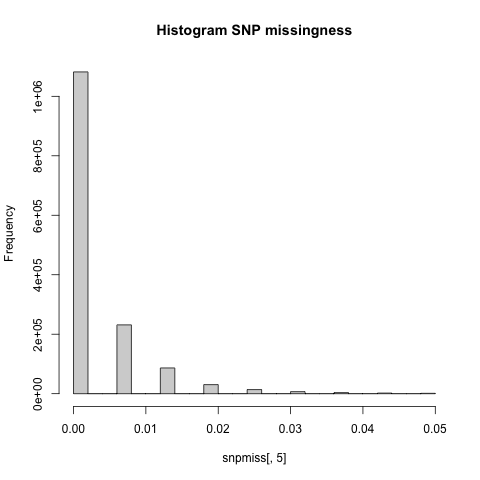

# QC of ADGWAS data

In this tutorial, you will learn how to perform all quality control steps that one typically takes before analyzing their genetic data further. The tutorial is based on `insert download link for code`. This code-file forms a pipeline that performs all quality control steps taken here in tandem. The code can easily be adjusted such that it works with any genetic dataset, and is a good starting point to perform your own analyses. 

!!! note
    You will need `plink` in this section, which can be download from [here](https://www.cog-genomics.org/plink/1.9/).

    Install the program `plink` and include its location in your PATH directory, which allows us to use `plink` instead of `./plink` in the commands below. If PLINK is not in your PATH directory and is instead in your working directory, replace all instances of `plink` in the tutorial with `./plink`.

##Obtaining genetic data on alzheimer's disease cases and controls
The first step in GWAS analyses is to generate or obtain the genotype or sequencing data. In this tutorial, we will store this data in binary PLINK format. Binary PLINK datasets consist of three corresponding files: *.bim, *.bed, and *.fam. A *.fam file contains information on the individuals in the dataset, whereas the *.bim file contains information on the genetic markers that are included. The *.bed file is typically the largest and contains the genotypes. As it is written in binary, it is not in readable format for humans.

In this tutorial, we use real-world genetic data on alzheimer's diseases cases and controls collected by Webster et al., (2009). Although this data was cleaned by the authors of this paper, we made some alterations to make the data ``dirtier'', such that this tutorial familiarizes you with issues that may occur when analyzing uncleaned data.

You can download the AD data [here](https://drive.google.com/drive/folders/1TNRwAxWx_itjjt3dbtsR0CrUgkKk5yxw?usp=sharing) 

## Reading the genotype data file:
We will set a **FILESET** variable to refer to our raw genotype datafile throughout this tutorial. This makes it easier to adjust the code used here for analyses on your own data, as you only need to change the **FILESET** variable towards the name of your own datafile, provided that it is stored in the .bim/.bed/.fam format. Next, we will set our working directory towards the directory in which we have stored the HapMap data. Furthermore, ensure that the PLINK application is in your working directory. You can use the bash command **ls** to check whether your working directory holds all the necessary files.  

```bash
FILESET=adgwasTutorial
cd HOME/{user}/{path/folder containing your files}
ls 
```

??? note "Check whether all files are stored in your working directory:"
      
      ```bash
      $ ls
      adgwas.bed  adgwas.bim  adgwas.fam  plink
      ```

Before we start performing QC on the HapMap data, ensure that you familiarize yourself with the format in which the datafiles are stored. Use the **head** command to see the beginning of a file.

```bash
head $FILESET.fam
head $FILESET.bim
```

??? note "This results in the following output:"
      
      ```bash
      $ head $FILESET.fam
      WGAAD 10 0 0 2 2
      WGAAD 15 0 0 1 2
      WGAAD 18 0 0 2 2
      WGAAD 20 0 0 1 2
      WGAAD 24 0 0 2 2
      WGAAD 25 0 0 2 2
      WGAAD 28 0 0 2 2
      WGAAD 29 0 0 1 2
      WGAAD 31 0 0 1 2
      WGAAD 35 0 0 2 2

      $ head $FILESET.bim
      1       rs3094315       0       792429  C       T
      1       rs4040617       0       819185  G       A
      1       rs2980300       0       825852  A       G
      1       rs4075116       0       1043552 G       A
      1       rs9442385       0       1137258 T       G
      1       rs10907175      0       1170650 C       A
      1       rs2887286       0       1196054 C       T
      1       rs6603781       0       1198554 T       C
      1       rs11260562      0       1205233 T       C
      1       rs6685064       0       1251215 T       C
      ```

These files have no headers but are always structured the same. The structure of a .fam file is as follows:

- **Column 1** contains the family id
- **Column 2** contains the Within-family id
- **Column 3** contains the Within-family id of the father ('0' if the father is not included in the data)
- **Column 4** contains the Within-family id of the mother ('0' if the mother is not included in the data)
- **Column 5** contains the individual's sex ('1' for male, '2' for female '0' if unknown)
- **Column 6** contains the value of the phenotype ('1' for cases, '2' for controls. Missing data points are often stored as '-9', '0', or a non-numeric character)

Many datasets do not sample families, but rather single individuals. As a result, the family id does in the .fam file does not have an interpretation, but nonetheless exists as the .fam format requires it. Some datasets choose to set the family id equal to the within-family id. Our dataset is differently structured: Cases are assigned a family id ``WGAAD'', whereas controls are assigned a family id ``WGACON''. 

The structure of a .bim file is as follows:
 
- **Column 1** contains the chromosome code (integer, 'X'/'Y'/'XY'/'MT', or '0' if unknown), or the chromosome name
- **Column 2** contains the identifier of the genetic variant
- **Column 3** contains the position in morgans or centimorgans, but this value is usually set to '0'.
- **Column 4** contains the base-pair coordinate.
- **Column 5** contains the reference allele (Allele 1), which is usually the minor allele.
- **Column 6** contains the alternative allele (Allele 2), which is usually the major allele.

One could run the command **head $FILESET.bed** as well, but this would result in gibberish: the .bed file is not legible to humans.

## Visualizing and correcting for missingness
As a first step in our QC, we evoke PLINK to produce SNP and individual missingness data. The **plink** command in bash will start the PLINK program. The option **-bfile** is used to read the data (in binary PLINK format), the option **--missing** creates a **plink.imiss** and **plink.lmiss** output file with the individual and SNP missingness data, respectively.   

```bash
plink -bfile $FILESET --missing
```

??? note "PLINK gives us the following output:" 

      ```bash
      PLINK v1.90b6.17 64-bit (28 Apr 2020)          www.cog-genomics.org/plink/1.9/
      (C) 2005-2020 Shaun Purcell, Christopher Chang   GNU General Public License v3
      Logging to plink.log.
      Options in effect:
        --bfile adgwas
        --missing

      12574 MB RAM detected; reserving 6287 MB for main workspace.
      380157 variants loaded from .bim file.
      364 people (190 males, 174 females) loaded from .fam.
      364 phenotype values loaded from .fam.
      Using 1 thread (no multithreaded calculations invoked).
      Before main variant filters, 364 founders and 0 nonfounders present.
      Calculating allele frequencies... done.
      Warning: 3 het. haploid genotypes present (see plink.hh ); many commands treat
      these as missing.
      Total genotyping rate is 0.975068.
      --missing: Sample missing data report written to plink.imiss, and variant-based
      missing data report written to plink.lmiss.
      ```

??? note "Inspect plink.imiss and plink.lmiss"
      
      ```bash 
      $ head plink.imiss
      FID  IID MISS_PHENO   N_MISS   N_GENO   F_MISS
      WGAAD   10          N    12601   380157  0.03315
      WGAAD   15          N    10730   380157  0.02823
      WGAAD   18          N    10755   380157  0.02829
      WGAAD   20          N    15950   380157  0.04196
      WGAAD   24          N     6735   380157  0.01772
      WGAAD   25          N    12531   380157  0.03296
      WGAAD   28          N    10696   380157  0.02814
      WGAAD   29          N     8175   380157   0.0215
      WGAAD   31          N     7850   380157  0.02065
      ```
   
      The column headers correspond to the following: 

      - **FID**: Family ID
      - **IID**: Individual ID
      - **MISS_PHENO**:  Missing phenotype? (Y/N)
      - **N_MISS**: Number of missing SNPs
      - **N_GENO**: Number of non-obligatory missing genotypes
      - **F_MISS**: Proportion of missing SNPs

      ```bash
      $ head plink.lmiss
      CHR             SNP   N_MISS   N_GENO   F_MISS
        1       rs3094315        3      364 0.008242
        1       rs4040617        1      364 0.002747
        1       rs2980300       22      364  0.06044
        1       rs4075116        1      364 0.002747
        1       rs9442385        2      364 0.005495
        1      rs10907175       11      364  0.03022
        1       rs2887286       28      364  0.07692
        1       rs6603781        9      364  0.02473
        1      rs11260562        0      364        0
      ```

      The column headers correspond to the following: 

      - **CHR**: Chromosome
      - **SNP**: SNP rsID
      - **N_MISS**:  Number of individuals for which this SNP is missing
      - **N_GENO**: Number of non-obligatory missing genotypes
      - **F_MISS**: Proportion of sample missing for this SNP

### Generate Histogram to view missingness. 

To summarize the extent of missing data, we load both files into R, and generate histograms to visualize the proportion of missingness in the data, per individual and per SNP, respectively.

=== "Performed in R"
```{r}
indmiss<-read.table(file="plink.imiss", header=TRUE)
snpmiss<-read.table(file="plink.lmiss", header=TRUE)
# read data into R 

png("histimiss.png") #indicates png format and gives title to file
hist(indmiss[,6],main="Histogram individual missingness") #selects column 6, names header of file
dev.off()

png("histlmiss.png")
hist(snpmiss[,5],main="Histogram SNP missingness")  
dev.off() # shuts down the current device
```


As can be seen, many SNPs are genotyped with little missingness, but some SNPs are missing in over 2% of individuals, and sometimes even missing in over 10% of our dataset. there is individuals vary considerable in the fraction of their genotype that is missing. Many individuals have missing data at 2% or even more of all SNP loci. Similarily, most SNPs are available in virtually all individuals in our dataset, although some SNPs are missing with considerable frequency, i.e. in 2% or even up to 8% of all individuals. If missingness differs between cases and controls at some loci and such missingness is non-random, false positives are likely to abound in our association analysis. 

??? note "Missingness in a more recent dataset (Hapmap)"
    The data we use in this tutorial was collected in 2009. Recent advancements in genotyping ensure that missingness in more modern datasets     is likely to be considerably smaller. As an illustration, this is what the two missingness plot look like in HapMap data: 
    
    
    


### Filter on missingness

As a first step of the quality control process, we will drop SNPs that are missing with considerable frequency from our data. Furthermore, we will drop individuals who frequently have missing genotype calls.

We begin with defining our starting filter values. We recommend a missing genotype threshold of 2% (MIND) for each individual, as well as a missingness threshold of 2% (GENO) for each SNP. Again, defining these values as a seperate variable makes them easier to change when using this code for different analyses.

```bash
GENO=0.02 
MIND=0.02 
```
In the following plink commands, the **--make-bed** flag instructs plink to convert the data back into the PLINK binary format after the filtering has been performed. The **--out** flag is used to name the resulting output file. It is **important** to filter on SNP missingness (**--geno**) prior to filtering on individual missingness (**--mind**). Furtermore, we recommend to filter for missingness in two steps: once with a very lenient missingness threshold (i.e. 20%), and next with the missingness threshold you set (i.e. 2%). This two-step approach shields you from bad scenarios where, for example, many SNPs would fall above the missingness threshold if a subset of individuals have extremely high rates of missingness. Note, however, that most high quality genetic datasets should not have any SNPs or individuals with missingness >20%, and if this is the case, it should give reason to worry about whether the data was pre-processed correctly. Furthermore, we strongly advise to filter on SNPs first, and next on individuals, as filtering out badly genotyped SNPs will highly reduce the missingness of remaining SNPs in individuals, such that many will fall below the 2% threshold. 

```bash
plink --bfile $FILESET --geno 0.2 --make-bed --out $FILESET.geno.temp
plink --bfile $FILESET.geno.temp --mind 0.2 --make-bed --out $FILESET.mind.temp
plink --bfile $FILESET.mind.temp --geno $GENO --make-bed --out $FILESET.geno
plink --bfile $FILESET.geno --mind $MIND --make-bed --out $FILESET.mind
```

??? note "This results in the following output:"

      ```bash
      $plink --bfile $FILESET --geno 0.2 --make-bed --out $FILESET.geno.temp
      PLINK v1.90b6.17 64-bit (28 Apr 2020) www.cog-genomics.org/plink/1.9/
      (C) 2005-2020 Shaun Purcell, Christopher Chang   GNU General Public License v3
      Logging to adgwas.geno.temp.log.
      Options in effect:
        --bfile adgwas
        --geno 0.2
        --make-bed
        --out adgwas.geno.temp

      12574 MB RAM detected; reserving 6287 MB for main workspace.
      380157 variants loaded from .bim file.
      364 people (190 males, 174 females) loaded from .fam.
      364 phenotype values loaded from .fam.
      Using 1 thread (no multithreaded calculations invoked).
      Before main variant filters, 364 founders and 0 nonfounders present.
      Calculating allele frequencies... done.
      Warning: 3 het. haploid genotypes present (see adgwas.geno.temp.hh ); many
      commands treat these as missing.
      Total genotyping rate is 0.975068.
      0 variants removed due to missing genotype data (--geno).
      380157 variants and 364 people pass filters and QC.
      Among remaining phenotypes, 176 are cases and 188 are controls.
      --make-bed to adgwas.geno.temp.bed + adgwas.geno.temp.bim +
      adgwas.geno.temp.fam ... done.

      $ plink --bfile $FILESET.geno.temp --mind 0.2 --make-bed --out $FILESET.mind.temp
      PLINK v1.90b6.17 64-bit (28 Apr 2020) www.cog-genomics.org/plink/1.9/
      (C) 2005-2020 Shaun Purcell, Christopher Chang   GNU General Public License v3
      Logging to adgwas.mind.temp.log.
      Options in effect:
        --bfile adgwas.geno.temp
        --make-bed
        --mind 0.2
        --out adgwas.mind.temp

      12574 MB RAM detected; reserving 6287 MB for main workspace.
      380157 variants loaded from .bim file.
      364 people (190 males, 174 females) loaded from .fam.
      364 phenotype values loaded from .fam.
      0 people removed due to missing genotype data (--mind).
      Using 1 thread (no multithreaded calculations invoked).
      Before main variant filters, 364 founders and 0 nonfounders present.
      Calculating allele frequencies... done.
      Warning: 3 het. haploid genotypes present (see adgwas.mind.temp.hh ); many
      commands treat these as missing.
      Total genotyping rate is 0.975068.
      380157 variants and 364 people pass filters and QC.
      Among remaining phenotypes, 176 are cases and 188 are controls.
      --make-bed to adgwas.mind.temp.bed + adgwas.mind.temp.bim +
      adgwas.mind.temp.fam ... done.
      
      $ plink --bfile $FILESET.mind.temp --geno $GENO --make-bed --out $FILESET.geno
      PLINK v1.90b6.17 64-bit (28 Apr 2020)          www.cog-genomics.org/plink/1.9/
      (C) 2005-2020 Shaun Purcell, Christopher Chang   GNU General Public License v3
      Logging to adgwas.geno.log.
      Options in effect:
        --bfile adgwas.mind.temp
        --geno 0.02
        --make-bed
        --out adgwas.geno

      12574 MB RAM detected; reserving 6287 MB for main workspace.
      380157 variants loaded from .bim file.
      364 people (190 males, 174 females) loaded from .fam.
      364 phenotype values loaded from .fam.
      Using 1 thread (no multithreaded calculations invoked).
      Before main variant filters, 364 founders and 0 nonfounders present.
      Calculating allele frequencies... done.
      Warning: 3 het. haploid genotypes present (see adgwas.geno.hh ); many commands
      treat these as missing.
      Total genotyping rate is 0.975068.
      160562 variants removed due to missing genotype data (--geno).
      219595 variants and 364 people pass filters and QC.
      Among remaining phenotypes, 176 are cases and 188 are controls.
      --make-bed to adgwas.geno.bed + adgwas.geno.bim + adgwas.geno.fam ... done.
    
      $ plink --bfile $FILESET.geno --mind $MIND --make-bed --out $FILESET.mind
      PLINK v1.90b6.17 64-bit (28 Apr 2020)          www.cog-genomics.org/plink/1.9/
      (C) 2005-2020 Shaun Purcell, Christopher Chang   GNU General Public License v3  
      Logging to adgwas.mind.log.
      Options in effect:
        --bfile adgwas.geno
        --make-bed
        --mind 0.02
        --out adgwas.mind

      12574 MB RAM detected; reserving 6287 MB for main workspace.
      219595 variants loaded from .bim file.
      364 people (190 males, 174 females) loaded from .fam.
      364 phenotype values loaded from .fam.
      18 people removed due to missing genotype data (--mind).
      IDs written to adgwas.mind.irem .
      Using 1 thread (no multithreaded calculations invoked).
      Before main variant filters, 346 founders and 0 nonfounders present.
      Calculating allele frequencies... done.
      Warning: 2 het. haploid genotypes present (see adgwas.mind.hh ); many commands
      treat these as missing.
      Total genotyping rate in remaining samples is 0.994392.
      219595 variants and 346 people pass filters and QC.
      Among remaining phenotypes, 169 are cases and 177 are controls.
      --make-bed to adgwas.mind.bed + adgwas.mind.bim + adgwas.mind.fam ... done.
      ``` 

As expected, In the first step, 0 variants and 0 individuals were removed from the data. When subsequently filtering on the stricter threshold of 0.02, 160562 variants removed due to missing genotype data (--geno), leaving 219595 SNPs. Finally, 18 people were removed due to missing genotype data, leaving 346 individuals. 

**Remove SNPS with Significant Levels of Differential Missingness**
It could be that the <2% missingness of the remaining SNPs in our dataset is non-randomly distributed between cases and controls, which could subsequently cause bias in our association analyses. The --test-missing flag in plink performs Fischer's exact test to test for differential missingness between cases and controls.   

```bash
plink --bfile $FILESET.mind --test-missing
```

The results are written to plink.missing

??? note "Inspect plink.missing"
      
      $head plink.missing
       CHR             SNP     F_MISS_A     F_MISS_U            P
        1       rs3094315            0       0.0113       0.4988
        1       rs4040617            0      0.00565            1
        1       rs4075116            0      0.00565            1
        1       rs9442385      0.01183            0       0.2378
        1       rs6685064      0.02367            0      0.05588
        1        rs307378      0.01183      0.00565       0.6154
        1       rs6603791            0      0.00565            1
        1       rs7519837            0      0.00565            1
        1       rs3817856      0.01183       0.0113            1
        
We advise to drop SNPs that have differential missingness with a p-value < 1e-8. We recommend this p-value because... . We use the bash command ``awk'' to select the lines of plink.missing that have a value in column 5 (the p-value column) smaller than this threshold, and subsequently select column 2 of SNP rsIDs that belong to these SNPs. Next, the --exclude command is used in PLINK to filter out these SNP rsIDs.  

```bash
awk '$5 <= 1e-8' plink.missing | awk '{print $2}' > differentialsnps.txt
plink --bfile  $FILESET.mind --exclude differentialsnps.txt --make-bed --out  $FILESET.mind.diff
```

??? "This results in the following output:"
      
      ```bash
      plink --bfile  $FILESET.mind --exclude differentialsnps.txt --make-bed --out              $FILESET.mind.diff
      PLINK v1.90b6.17 64-bit (28 Apr 2020) www.cog-genomics.org/plink/1.9/
      (C) 2005-2020 Shaun Purcell, Christopher Chang   GNU General Public License v3
      Logging to adgwas.mind.diff.log.
      Options in effect:
        --bfile adgwas.mind
        --exclude differentialsnps.txt
        --make-bed
        --out adgwas.mind.diff

      12574 MB RAM detected; reserving 6287 MB for main workspace.
      219595 variants loaded from .bim file.
      346 people (182 males, 164 females) loaded from .fam.
      346 phenotype values loaded from .fam.
      --exclude: 219595 variants remaining.
      Using 1 thread (no multithreaded calculations invoked).
      Before main variant filters, 346 founders and 0 nonfounders present.
      Calculating allele frequencies... done.
      Warning: 2 het. haploid genotypes present (see adgwas.mind.diff.hh ); many
      commands treat these as missing.
      Total genotyping rate is 0.994392.
      219595 variants and 346 people pass filters and QC.
      Among remaining phenotypes, 169 are cases and 177 are controls.
      --make-bed to adgwas.mind.diff.bed + adgwas.mind.diff.bim +
      adgwas.mind.diff.fam ... done.
      ```
## Check for Sex Discrepancies
    
We check whether each individual's assigned sex corresponds with their genotype. The **--check-sex** flag in PLINK tests this by calculating X chromosome homozygosity. Males should have an X chromosome homozygosity estimate >0.8. Females should have a value < 0.2. Subjects who do not fulfill these requirements are flagged as a "PROBLEM" by PLINK.

!!! note
      The **--check-sex** flag supposes that the x chromosome has been split. This means        that in the .bim file you should see SNPs assigned to a 25th chromosome. This             chromosome represents the SNPs lying on the pseudoautosomal region of the X               chromosome. If you have not already done so, YOU MUST use the **--split-x** flag          to seperate the pseudoautosomal region in this fashion.

First, we want to visualize the F-values and check for discrepencies.

```bash
plink --bfile $FILESET.mind.diff --check-sex 
```

??? note "This results in the following output:"

      ```bash 
      $plink --bfile $FILESET.mind.diff --check-sex
      PLINK v1.90b6.17 64-bit (28 Apr 2020) www.cog-genomics.org/plink/1.9/
      (C) 2005-2020 Shaun Purcell, Christopher Chang GNU General Public License v3
      Logging to plink.log.
      Options in effect:
       --bfile adgwasTutorial.mind.diff
        --check-sex

      12574 MB RAM detected; reserving 6287 MB for main workspace.
      219595 variants loaded from .bim file.
      346 people (182 males, 164 females) loaded from .fam.
      346 phenotype values loaded from .fam.
      Using 1 thread (no multithreaded calculations invoked).
      Before main variant filters, 346 founders and 0 nonfounders present.
      Calculating allele frequencies... done.
      Warning: 2 het. haploid genotypes present (see plink.hh ); many commands treat
      these as missing.
      Total genotyping rate is 0.994392.
      219595 variants and 346 people pass filters and QC.
      Among remaining phenotypes, 169 are cases and 177 are controls.
      --check-sex: 5357 Xchr and 0 Ychr variant(s) scanned, 1 problem detected.
      Report written to plink.sexcheck .
      ```
Plink reports that one individual has a different sex as determined by the X chromosome, compared to sex assigned in the pedigree file.

??? note "Inspect plink.sexcheck:"


      ```bash
      head plink.sexcheck
          FID  IID       PEDSEX       SNPSEX       STATUS            F
        WGAAD   10            2            2           OK       -0.112
        WGAAD   15            1            1           OK            1
        WGAAD   18            2            1      PROBLEM            1
        WGAAD   20            1            1           OK            1
        WGAAD   24            2            2           OK    -0.005006
        WGAAD   25            2            2           OK     -0.07384
        WGAAD   28            2            2           OK     -0.04113
        WGAAD   29            1            1           OK            1
        WGAAD   31            1            1           OK            1
      ```

      The column headers correspond to the following 
      
      - **FID**:     Family ID
      - **IID**:     Individual ID
      - **PEDSEX**:  Sex as determined in pedigree file (1=male, 2=female)
      - **SNPSEX**:  Sex as determined by X chromosome
      - **STATUS**:  Displays "PROBLEM" or "OK" for each individual
      - **F**:       The actual X chromosome inbreeding (homozygosity) estimate

We now visualize the estimated X chromosome homozygosity for assigned males and females in R:

=== "Performed in R"
```{r}
gender <- read.table("plink.sexcheck", header=T,as.is=T)

png("Gender_check.png")
hist(gender[,6],main="Gender", xlab="F")
dev.off()

png("Men_check.png")
male=subset(gender, gender$PEDSEX==1)
hist(male[,6],main="Men",xlab="F")
dev.off()

png("Women_check.png")
female=subset(gender, gender$PEDSEX==2)
hist(female[,6],main="Women",xlab="F")
dev.off()
```


  
The third histogram shows where the problem lies: one individual is marked as female in the pedigree file, but is male according to the X chromosome. PLINK has marked this case as ``PROBLEM'' in column 5 of plink.sexcheck. We will use grep and awk to print the FID and IID of this person, and remove this person from our data using the **--remove** flag in PLINK.

```bash
grep "PROBLEM" plink.sexcheck| awk '{print$1,$2}'> sex_discrepancy.txt
plink --bfile $FILESET.mind.diff --remove sex_discrepancy.txt --make-bed --out $FILESET.rem
```

## Limit data to autosomal SNPs only 

Most genetic analysis focuses solely on autosomal SNPs, ignoring the sex chromosome or mitochondrial DNA. We will use the **--extract** flag in PLINK to extract only such SNPs. Before using this flag, we will generate a list of RSids that lie on the autosome (chromosome 1-22), using the awk command. 

```bash
awk '{ if ($1 >= 1 && $1 <= 22) print $2 }' $FILESET.rem.bim > snp_1_22.txt
plink --bfile $FILESET.rem --extract snp_1_22.txt --make-bed --out $FILESET.autosome
```
## Perform MAF check and filter by MAF Threshold
Next, we will check the minor allele frequency (MAF) of each SNP. SNPs with a low MAF are rare. As a result, power to detect their associations with a given phenotype is low. Furthermore, such SNPs are more prone to genotyping errors. The **--freq** flag in PLINK is used to calculate MAFs. 


```bash
plink --bfile $FILESET.autosome --freq --out MAF_check
```

??? note "PLINK reports the following output: "

      ```bash
      plink --bfile $FILESET.autosome --freq --out MAF_check
      PLINK v1.90b6.17 64-bit (28 Apr 2020) www.cog-genomics.org/plink/1.9/
      (C) 2005-2020 Shaun Purcell, Christopher Chang GNU General Public License v3
      Logging to MAF_check.log.
      Options in effect:
        --bfile adgwasTutorial.autosome
        --freq
        --out MAF_check

      12574 MB RAM detected; reserving 6287 MB for main workspace.
      214159 variants loaded from .bim file.
      345 people (182 males, 163 females) loaded from .fam.
      345 phenotype values loaded from .fam.
      Using 1 thread (no multithreaded calculations invoked).
      Before main variant filters, 345 founders and 0 nonfounders present.
      Calculating allele frequencies... done.
      Total genotyping rate is 0.994377.
      --freq: Allele frequencies (founders only) written to MAF_check.frq 
      ```
This creates the file MAF_check.frq. 

??? note "Inspect MAF_check.frq:"

      ```bash
      head MAF_check.frq
        CHR             SNP   A1   A2          MAF  NCHROBS
          1       rs3094315    C    T       0.1633      686
          1       rs4040617    G    A       0.1119      688
          1       rs4075116    G    A       0.3009      688
          1       rs9442385    T    G       0.0758      686
          1      rs11260562    T    C      0.04783      690
          1       rs6685064    T    C      0.06012      682
          1        rs307378    T    G      0.02485      684
          1       rs3766180    G    A       0.2928      690
          1       rs6603791    G    A       0.3212      688
      ```
Again, use R to visualize the MAF distribution.

=== "Performed in R"
```{r}
maf_freq <- read.table("MAF_check.frq", header =TRUE, as.is=T)
png("MAF_distribution.png")
hist(maf_freq[,5],main = "MAF distribution", xlab = "MAF")
dev.off()
```


!!! note "MAF in HapMap data"
      We note that this distribution looks different than it would look in a less clean         dataset, because the providers of this data already incorporate a MAF cutoff (albeit       not at the conservative level that we recommend). This is what the distribution of        MAFs looks like in uncleaned HapMap 3 data. As you can see, extremely low MAFs are          much more common in a typical, uncleaned dataset:
      

Now, we want to filter any SNPs with a low MAF. The larger your dataset, the higher your power, such that you can set a less conservative MAF threshold. We recommend to throw out all SNPs with MAF < 0.05 for a small data set such as the current one. For a larger dataset `What is larger?`, this threshold can be relaxed to 0.01.

The **--maf** flag in PLINK filters out SNPs that fall below the given threshold.

```bash
MAF=0.05
plink --bfile $FILESET.autosome --maf $MAF --make-bed --out $FILESET.maf
```

??? note "PLINK reports the following output: "

    ```bash
    $plink --bfile $FILESET.autosome --maf $MAF --make-bed --out $FILESET.maf
    PLINK v1.90b6.17 64-bit (28 Apr 2020) www.cog-genomics.org/plink/1.9/
    (C) 2005-2020 Shaun Purcell, Christopher Chang GNU General Public License v3
    Logging to adgwasTutorial.maf.log.
    Options in effect:
      --bfile adgwasTutorial.autosome
      --maf 0.05
      --make-bed  
      --out adgwasTutorial.maf

    12574 MB RAM detected; reserving 6287 MB for main workspace.
    214159 variants loaded from .bim file.
    345 people (182 males, 163 females) loaded from .fam.
    345 phenotype values loaded from .fam.
    Using 1 thread (no multithreaded calculations invoked).
    Before main variant filters, 345 founders and 0 nonfounders present.
    Calculating allele frequencies... done.
    Total genotyping rate is 0.994377.
    23112 variants removed due to minor allele threshold(s)
    (--maf/--max-maf/--mac/--max-mac).
    191047 variants and 345 people pass filters and QC.
    Among remaining phenotypes, 168 are cases and 177 are controls.
    --make-bed to adgwasTutorial.maf.bed + adgwasTutorial.maf.bim +
    adgwasTutorial.maf.fam ... done.
    ``` 
    
PLINK removed 23,112 SNPs, leaving 191,047 variants.

## View heterozygosity distribution and remove outliers 
We next check heterozygosity rates for all individuals within the sample. Excessively high or low heterozygosity rates could indicate sample contamination or inbreeding. 

### Generate a pruned subset of SNPs that are in approximate linkage equilibrium.
Heterozygosity must be computed in a set of independent SNPs. SNPs that are in linkage disequilibrium violate the independence assumption. Hence, we perform a procedure called ``variant pruning'' to reduce our dataset towards a set of SNPs that are in approximate linkage equilibrium with one another. The **--indep-pairwise** flag in PLINK performs the pruning procedure. Its syntax is --indep-pairwise <window size>['kb'] <step size (variant ct)> <r^2 threshold>. Within each window, PLINK computes the pairwise r^2 between each SNP, removes one of the SNPs (the one with the lowest MAF) if the pairwise r^2 is larger than the r^2 threshold, and repeats until no SNPs within the window have an r^2 above the given threshold. The algorithm will then shift its window, as given by the step size argument, and repeat. We recommend to set a window of 50kb, a step size of 5, and an r^2 threshold of 0.5.  

```bash
plink --bfile $FILESET.maf --indep-pairwise 50 5 0.5
```

??? note "PLINK reports the following output: "

    ```bash
    $ plink --bfile $FILESET.maf --indep-pairwise 50 5 0.5
    PLINK v1.90b6.17 64-bit (28 Apr 2020) www.cog-genomics.org/plink/1.9/
    (C) 2005-2020 Shaun Purcell, Christopher Chang   GNU General Public License v3
    Logging to plink.log.
    Options in effect:
     --bfile adgwasTutorial.maf
      --indep-pairwise 50 5 0.5

    12574 MB RAM detected; reserving 6287 MB for main workspace.
    191047 variants loaded from .bim file.
    345 people (182 males, 163 females) loaded from .fam.
    345 phenotype values loaded from .fam.
    Using 1 thread (no multithreaded calculations invoked).
    Before main variant filters, 345 founders and 0 nonfounders present.
    Calculating allele frequencies... done.
    Total genotyping rate is 0.994415.
    191047 variants and 345 people pass filters and QC.
    Among remaining phenotypes, 168 are cases and 177 are controls.
    Pruned 7620 variants from chromosome 1, leaving 7808.
    Pruned 8213 variants from chromosome 2, leaving 7858.
    Pruned 6504 variants from chromosome 3, leaving 6589.
    Pruned 5905 variants from chromosome 4, leaving 5917.
    Pruned 6226 variants from chromosome 5, leaving 6230.
    Pruned 6273 variants from chromosome 6, leaving 6143.
    Pruned 4811 variants from chromosome 7, leaving 5232.
    Pruned 5625 variants from chromosome 8, leaving 5328.
    Pruned 4385 variants from chromosome 9, leaving 4710.
    Pruned 5807 variants from chromosome 10, leaving 5576.
    Pruned 5404 variants from chromosome 11, leaving 4862.
    Pruned 4584 variants from chromosome 12, leaving 4995.
    Pruned 3388 variants from chromosome 13, leaving 3693.
    Pruned 2726 variants from chromosome 14, leaving 3238.
    Pruned 2538 variants from chromosome 15, leaving 2998.
    Pruned 2895 variants from chromosome 16, leaving 3385.
    Pruned 2056 variants from chromosome 17, leaving 2619.
    Pruned 2628 variants from chromosome 18, leaving 3031.
    Pruned 1015 variants from chromosome 19, leaving 1649.
    Pruned 2526 variants from chromosome 20, leaving 2634.
    Pruned 1302 variants from chromosome 21, leaving 1491.
    Pruned 1143 variants from chromosome 22, leaving 1487.
    Pruning complete.  93574 of 191047 variants removed.
    Marker lists written to plink.prune.in and plink.prune.out .
    ```

The list of SNP rsIDs kept by the pruning procedure is given by plink.prune.in. The SNPs that are removed (93,547 of 191,047 variants), as they were in linkage disequilibrium with one or more of the SNPs in plink.prune.in, are listed in plink.prune.out

??? note "Inspect plink.prune.in: "

      ```bash
      head plink.prune.in
      rs3094315
      rs4075116
      rs9442385
      rs6685064
      rs6603791
      rs3817856
      rs2281173
      rs10907187
      rs6603803
      rs7513222
      ```

**Compute method-of-moments F coefficient estimates**

The **--het** flag in PLINK computes observed and expected autosomal homozygous genotype counts for each sample, and reports method-of-moments F coefficient estimates (i.e. (observed hom. count - expected count) / (total observations - expected count)) in the output file. We compute these statistics on the pruned SNPs only. 

```bash
plink --bfile $FILESET.maf --extract plink.prune.in --het --out R_check 
```

??? note "This results in the following output: "
      
      ```bash
      $ plink --bfile $FILESET.maf --extract plink.prune.in --het --out R_check
      PLINK v1.90b6.17 64-bit (28 Apr 2020) www.cog-genomics.org/plink/1.9/
      (C) 2005-2020 Shaun Purcell, Christopher Chang   GNU General Public License v3
      Logging to R_check.log.
      Options in effect:
        --bfile adgwasTutorial.maf
        --extract plink.prune.in
        --het
        --out R_check

      12574 MB RAM detected; reserving 6287 MB for main workspace.
      191047 variants loaded from .bim file.
      345 people (182 males, 163 females) loaded from .fam.
      345 phenotype values loaded from .fam.
      --extract: 97473 variants remaining.
      Using 1 thread (no multithreaded calculations invoked).
      Before main variant filters, 345 founders and 0 nonfounders present.
      Calculating allele frequencies... done.
      Total genotyping rate is 0.994393.
      97473 variants and 345 people pass filters and QC.
      Among remaining phenotypes, 168 are cases and 177 are controls.
      --het: 97473 variants scanned, report written to R_check.het .
      ```
    
??? note "Inspect R_check.het"

      ```bash 
    $head R_check.het
    FID  IID       O(HOM)       E(HOM)        N(NM)            F
    WGAAD   10        63274    6.333e+04        96633    -0.001759
    WGAAD   15        63348    6.338e+04        96686    -0.001055
    WGAAD   20        62774    6.311e+04        96314     -0.01007
    WGAAD   24        63891    6.372e+04        97189     0.005227
    WGAAD   25        62993    6.321e+04        96445    -0.006576
    WGAAD   28        63486     6.36e+04        97015    -0.003463
    WGAAD   29        63428    6.361e+04        97044    -0.005455
    WGAAD   31        64113    6.371e+04        97187      0.01205
    WGAAD   35        63563    6.364e+04        97079    -0.002376
    ```

The column headers correspond to the following 
      
    - **FID**:	Family ID
    - **IID**:	Within-family ID
    - **O(HOM)**:	Observed number of homozygotes
    - **E(HOM)**:	Expected number of homozygotes
    - **N(NM)**:	Number of non-missing autosomal genotypes
    - **F**: 	Method-of-moments F coefficient estimate

Let's visualize the heterozygosity distribution in a histogram:

=== "Performed in R"
```{r}
het <- read.table("R_check.het", head=TRUE)
png("heterozygosity.png")
het$HET_RATE = (het$"N.NM." - het$"O.HOM.")/het$"N.NM."
hist(het$HET_RATE, xlab="Heterozygosity Rate", ylab="Frequency", main= "Heterozygosity Rate")
dev.off()
```


Next, let's create a list of individuals who deviate more than 3 standard deviations from the mean heterozygosity rate.

=== "Performed in R"
```{r}
het <- read.table("R_check.het", head=TRUE)
het$HET_RATE = (het$"N.NM." - het$"O.HOM.")/het$"N.NM."
het_fail = subset(het, (het$HET_RATE < mean(het$HET_RATE)-3*sd(het$HET_RATE)) | (het$HET_RATE > mean(het$HET_RATE)+3*sd(het$HET_RATE)));
het_fail$HET_DST = (het_fail$HET_RATE-mean(het$HET_RATE))/sd(het$HET_RATE);
write.table(het_fail, "fail-het-qc.txt", row.names=FALSE, quote=FALSE)
```

??? note "Inspect **fail-het-qc.txt**: "

      ```bash
      cat fail-het-qc.txt
      FID IID O.HOM. E.HOM. N.NM. F HET_RATE HET_DST
      WGAAD 44 66464 63850 97399 0.07782 0.317611063768622 -7.22399251269265
      WGAAD 478 66047 63710 97175 0.06987 0.320329302804219 -6.46404587948789
      WGACON 156 61476 62630 95644 -0.03501 0.357241436995525 3.85559552648621
      WGACON 176 64149 62590 95342 0.04767 0.327169558012209 -4.55169422553164
      WGACON 191 64406 62960 96003 0.04368 0.329125131506307 -4.00496839555034
      ```

Five individuals have an excessively low or high heterozygosity rate. We will remove these heterozygous outliers from the genetic data using PLINK. First, we save the first two columns of **fail-het-qc.txt** in a seperate file (sed 's/"// g' is used to remove the quotations marks, such that the file, which was created in R in R becomes compatible with PLINK). Next, we use **--remove** in PLINK to remove the outliers.

```bash
awk '{print$1, $2}' fail-het-qc.txt > het_fail_ind.txt
```
**remove individuals that are heterozygous outliers**
```bash
plink --bfile $FILESET.maf --remove het_fail_ind.txt --make-bed --out $FILESET.het_fix
```

??? note "The resulting output:"

    ```bash
    $ plink --bfile $FILESET.maf --remove het_fail_ind.txt --make-bed --out                   $FILESET.het_fix
    PLINK v1.90b6.17 64-bit (28 Apr 2020) www.cog-genomics.org/plink/1.9/
    (C) 2005-2020 Shaun Purcell, Christopher Chang GNU General Public License v3
    Logging to adgwasTutorial.het_fix.log.
    Options in effect:
      --bfile adgwasTutorial.maf
      --make-bed
      --out adgwasTutorial.het_fix
      --remove het_fail_ind.txt

    12574 MB RAM detected; reserving 6287 MB for main workspace.
    191047 variants loaded from .bim file.    
    345 people (182 males, 163 females) loaded from .fam.
    345 phenotype values loaded from .fam.
    --remove: 340 people remaining.
    Using 1 thread (no multithreaded calculations invoked).
    Before main variant filters, 340 founders and 0 nonfounders present.
    Calculating allele frequencies... done.
    Total genotyping rate in remaining samples is 0.994504.
    191047 variants and 340 people pass filters and QC.
    Among remaining phenotypes, 166 are cases and 174 are controls.
    --make-bed to adgwasTutorial.het_fix.bed + adgwasTutorial.het_fix.bim +
    adgwasTutorial.het_fix.fam ... done.
    ```

##Transfer files to use for population stratification
Congratulations! You have finished the first tutorial on quality control of genetic data. We will use the cleaned data in the next tutorial to diagnose and correct for population stratification. To set up the data file you created for the next tutorial, create a new directory, and move the final .bim/.bed/.fam files towards. We will also Also make sure PLINK is copied towards this new directory. 

**rename files and copy to population stratification folder** 
```bash
mkdir ../2_Population_stratification

cp $FILESET.het_fix.bed ../2_Population_stratification/$FILESET.qcout.bed
cp $FILESET.het_fix.bim ../2_Population_stratification/$FILESET.qcout.bim
cp $FILESET.het_fix.fam ../2_Population_stratification/$FILESET.qcout.fam
cp plink.prune.in ../2_Population_stratification
cp plink ../2_Population_stratification
```
**change directory into population stratification folder**
```bash
cd ../2_Population_stratification
```

##Further tips and further reading


##References
Webster, J. A., Gibbs, J. R., Clarke, J., Ray, M., Zhang, W., Holmans, P., ... & Myers, A. J. (2009). Genetic control of human brain transcript expression in Alzheimer disease. The American Journal of Human Genetics, 84(4), 445-458.

