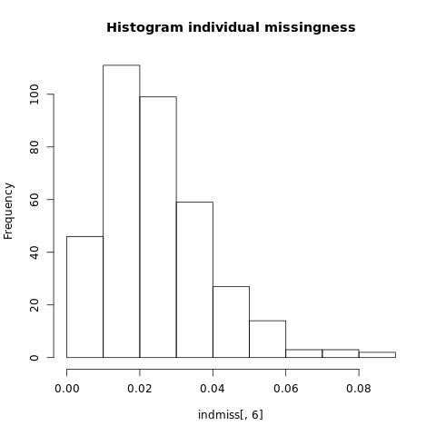

# QC of HapMap3 data
## Obtaining and visualizing missingness in the HapMap data files

The first step in GWAS analyses is to generate or obtain the genotype or sequencing data. Ideally these will be in Plink format (.bim,.bed,.fam)

You can download the HapMap example data [here](https://drive.google.com/drive/folders/1TNRwAxWx_itjjt3dbtsR0CrUgkKk5yxw?usp=sharing) 
You **MUST** download and unzip the R folder from [here](https://drive.google.com/drive/folders/1TNRwAxWx_itjjt3dbtsR0CrUgkKk5yxw?usp=sharing) as well to run downstream scripts. 

!!! note
    Due to limitation to bandwidth, we are currently using google drive to host the files, which doesn't allow the use of wget or curl to download the file. Please download the files manually.
 

!!! warning
    If you download the summary statistics on a MAC machine, the gz file may decompress automatically, which might result in a corrupted Height.gwas.txt file (including only the header). If this happens then you'll need to disable automatic decompression when downloading the file (eg. follow instructions [here](https://octet.oberlin.edu/does-your-mac-unzip-zip-files-automatically/ ))


### Reading the genotype data file and produce missingness data:
We will set a fileset variable to make it easier to adjust all downstream code and then produce SNP and individual missingness data:

```bash
FILESET=HapMap_3_r3_1
plink -bfile $FILESET --missing 
```

This will print a **plink.imiss** and **plink.lmiss** output file with the individual and SNP missingness data, respectively.  

The **plink.imiss** file contains the following columns:

|FID|IID|MISS_PHENO|N_MISS|N_GENO|F_MISS|
|:-:|:-:|:-:|:-:|:-:|:-:|
|1328|NA06989|N|4203|1457897|0.002883|
|1377|NA11891|N|20787|1457897|0.01426|
|1349|NA11843|N|1564|1457897|0.001073|

The column headers correspond to the following: 

- **FID**: Family ID
- **IID**: Individual ID
- **MISS_PHENO**:  Missing phenotype? (Y/N)
- **N_MISS**: Number of missing SNPs
- **N_GENO**: Number of non-obligatory missing genotypes
- **F_MISS**: Proportion of missing SNPs


### Generate Histogram to View Missingness. 


=== "Performed in R"

```{r}
indmiss<-read.table(file="plink.imiss", header=TRUE)
snpmiss<-read.table(file="plink.lmiss", header=TRUE)
# read data into R 

png("histimiss.png") #indicates pdf format and gives title to file
hist(indmiss[,6],main="Histogram individual missingness") #selects column 6, names header of file
dev.off()
png("histlmiss.png")
hist(snpmiss[,5],main="Histogram SNP missingness")  
dev.off() # shuts down the current device
```



> An example bar plot generated using script in `hist_miss.R`    

## Filtering steps  

#### Filter on missingness

We want to begin performing quality control filtering on the data.

We begin with organizing our file naming convention and define our starting filter values. 

```bash
sep="_"
TAG_GENO="geno"
GENO=0.02 
TAG_MIND="mind"
MIND=0.02 
OUT="$FILESET$sep$TAG_GENO"
OUT1="$FILESET$sep$TAG_GENO$sep$TAG_MIND"
```
In is **important** to filter on SNP missingness (--geno) prior to filtering on individual missingness (--mind). 

```bash
plink --bfile $FILESET --geno $GENO --make-bed --out $OUT
plink --bfile $OUT --mind $MIND --make-bed --out $OUT1
```
#### Check for Sex Discrepancies

Subjects who were a priori determined as females must have a F value of <0.2, and subjects who were a priori determined as males must have a F value >0.8. This F value is based on the X chromosome inbreeding (homozygosity) estimate. Subjects who do not fulfil these requirements are flagged "PROBLEM" by PLINK.
!!! note
    if you have not already done so, YOU MUST use the split-x command to remove the psuedo autosomal region

**First, we want to visualize the F-values and check for discrepencies.**
```bash
plink --bfile $OUT1 --check-sex 
# Generate plots to visualize the sex-check results.
```
=== "Performed in R"
```{r}
gender <- read.table("plink.sexcheck", header=T,as.is=T)

pdf("Gender_check.pdf")
hist(gender[,6],main="Gender", xlab="F")
dev.off()

pdf("Men_check.pdf")
male=subset(gender, gender$PEDSEX==1)
hist(male[,6],main="Men",xlab="F")
dev.off()

pdf("Women_check.pdf")
female=subset(gender, gender$PEDSEX==2)
hist(female[,6],main="Women",xlab="F")
dev.off()
```


  

Remove SNPS that do not pass the sex check. 

```bash
rem="rem"
OUT2=$OUT1$sep$rem
# This command generates a list of individuals with the status ?PROBLEM?.
grep "PROBLEM" plink.sexcheck| awk '{print$1,$2}'> sex_discrepancy.txt
plink --bfile $OUT1 --remove sex_discrepancy.txt --make-bed --out $OUT2
```

#### Limit data to autosomal SNPs only 

We wll generate a txt file with all the SNPS on the autosomes so that we can remove all SNPS that are on the sex chromosomes or in mitochondrial DND. 
```bash
BIM=".bim"
AUTOSOME="autosome"
OUT3=$OUT2$sep$AUTOSOME

awk '{ if ($1 >= 1 && $1 <= 23) print $2 }' $OUT2$BIM > snp_1_22.txt
plink --bfile $OUT2 --extract snp_1_22.txt --make-bed --out $OUT3
```
#### Perform MAF check and filter by MAF Threshold

```bash
plink --bfile $OUT2 --freq --out MAF_check
```

=== "Performed in R"
```{r}
maf_freq <- read.table("MAF_check.frq", header =TRUE, as.is=T)
pdf("MAF_distribution.pdf")
hist(maf_freq[,5],main = "MAF distribution", xlab = "MAF")
dev.off()
```


Now we want to filter out any SNPS with a MAF<0.05 for a small data set or 0.1 for a larger data set. 

```bash
TAG_MAF="maf"
OUT3=$OUT2$sep$TAG_MAF
MAF=0.05
plink --bfile $OUT2 --maf $MAF --make-bed --out $OUT3
```

#### View heterozygosity distribution and remove outliers 

**Generate a pruned subset of SNPs that are in approximate linkage equilibrium.**
```bash
plink --bfile $OUT3 --indep-pairwise 50 5 0.5
```
**Compute method-of-moments F coefficient estimates**

The --het flag in Plink computes observed and expected autosomal homozygous genotype counts for each sample, and reports method-of-moments F coefficient estimates (i.e. (<observed hom. count> - <expected count>) / (<total observations> - <expected count>)) to R_check.het. 

```bash
plink --bfile $OUT3 --extract plink.prune.in --het --out R_check 
```

=== "Plot of the heterozygosity rate distribution generated in R"
```{r}
het <- read.table("R_check.het", head=TRUE)
pdf("heterozygosity.pdf")
het$HET_RATE = (het$"N.NM." - het$"O.HOM.")/het$"N.NM."
hist(het$HET_RATE, xlab="Heterozygosity Rate", ylab="Frequency", main= "Heterozygosity Rate")
dev.off()
```


=== "list of individuals who deviate more than 3 standard deviations from the heterozygosity rate mean generated in R"
```{r}
het <- read.table("R_check.het", head=TRUE)
het$HET_RATE = (het$"N.NM." - het$"O.HOM.")/het$"N.NM."
het_fail = subset(het, (het$HET_RATE < mean(het$HET_RATE)-3*sd(het$HET_RATE)) | (het$HET_RATE > mean(het$HET_RATE)+3*sd(het$HET_RATE)));
het_fail$HET_DST = (het_fail$HET_RATE-mean(het$HET_RATE))/sd(het$HET_RATE);
write.table(het_fail, "fail-het-qc.txt", row.names=FALSE)
```

The command above generates the **fail-het-qc.txt** file and the command below saves the first two rows to a new file named **het_fail_ind.txt**

```bash
sed 's/"// g' fail-het-qc.txt | awk '{print$1, $2}' > het_fail_ind.txt
```
**remove individuals that are heterozygous outliers**
```bash
HET="het_fix"
OUT4=$OUT3$sep$HET
plink --bfile $OUT3 --remove het_fail_ind.txt --make-bed --out $OUT4
```

##Transfer files to use for population stratification
**rename files and copy to population stratification folder** 
```bash
mkdir 2_Population_stratification
bed=".bed"
fam=".fam"
bim=".bim"
mv $OUT4$bed ./qcout.bed
mv $OUT4$bim ./qcout.bim
mv $OUT4$fam ./qcout.fam
cp qcout* 2_Population_stratification
cp plink.prune.in 2_Population_stratification
```
**change directory into population stratification folder**
```bash
cd 2_Population_stratification
```
