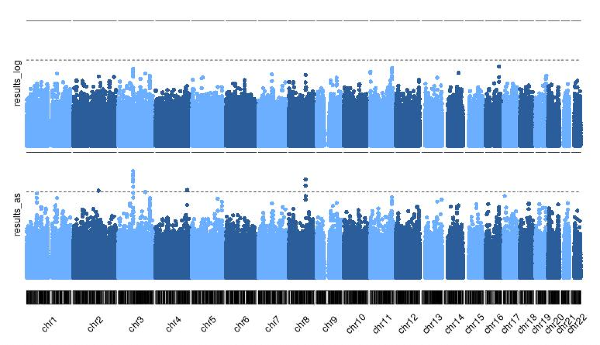
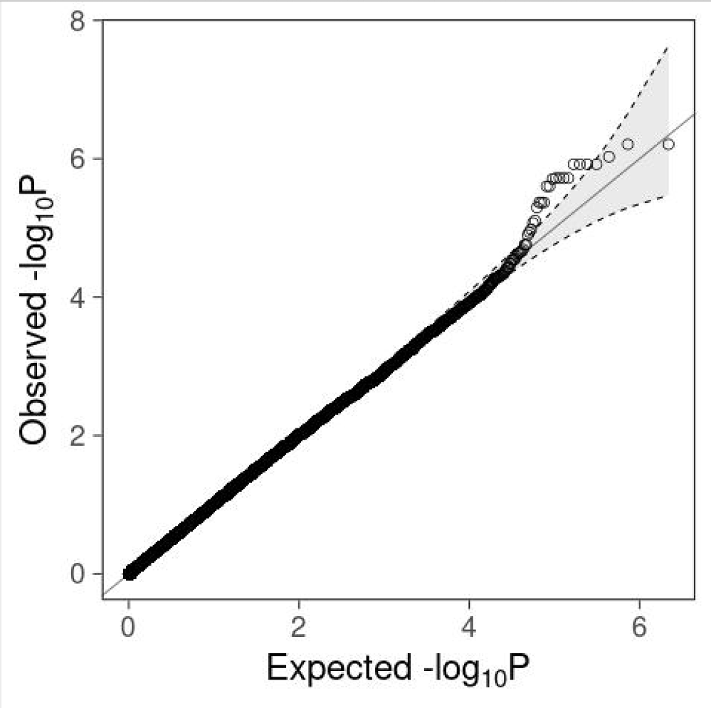

# Performing Association Analyses 

*For the association analyses we use the files generated in the previous tutorial (population stratification), named: popstratout (with .bed, .bim, and .fam. extensions) and covar_mds.txt*

##We only need to define a few variables for this section of the analysis##
```bash
FILE_GWAS=popstratout
FILE_COV=covar_mds.txt
tag_bim=".bim"
```

## Perform Association Analyses:

=== "logistic" 
    The **--logistic** method will allow you to include covariates in your association analysis. To include sex as a covariate (which is recommended for many phenotypes), add sex to the command as shown below. We will be using 10 principal components as covariates in this logistic analysis. We use the MDS components calculated from the previous tutorial: covar_mds.txt. We use the option **hide-covar** to only show the additive results of the SNPs in the output file.
    ```bash
    plink --bfile $FILE_GWAS --covar $FILE_COV --logistic 'hide-covar' --out logistic_results
    #plink --bfile $FILE_GWAS --covar $FILE_COV --logistic 'hide-covar' sex --out logistic_results
    ```
    **Remove NA values, those might give problems generating plots in later steps.**
    ```bash 
    awk '!/'NA'/' logistic_results.assoc.logistic > logistic_results.assoc_2.logistic
    ```
=== "--assoc"
    !!! note 
        the --assoc option does not allow to correct covariates such as principal components (PC's)/ MDScomponents, which makes it less suited for association analyses.
    ```bash
    plink --bfile $FILE_GWAS --assoc --out assoc_results
    ```

=== "--linear"
    In case of a quantitative outcome measure the option --logistic should be replaced by --linear. The use of the --assoc option is also possible for quantitative outcome measures (as metioned previously, this option does not allow the use of covariates). 
   

## Account for Multiple testing

There are various way to deal with multiple testing outside of the conventional genome-wide significance threshold of 5.0E-8, below we present a couple: 

#adjust
```bash
plink --bfile $FILE_GWAS -assoc --adjust --out adjusted_assoc_results
grep -oP '(?<==).*' adjusted_assoc_results.log >test.txt
sed 's/\.$//' test.txt >lambda.txt
```
The output file gives a Bonferroni corrected p-value, along with FDR and others.


## Permutation
!!! warning 
    This is a computational intensive step. Further pros and cons of this method, which can be used for association and dealing with multiple testing, are described in our article corresponding to this tutorial (https://www.ncbi.nlm.nih.gov/pubmed/29484742).To reduce computational time, we only perform this test on a subset of the SNPs from chromosome 22. The EMP2 column provides the values for multiple testing corrected p-value.

```bash
# Perform 1000000 permutations.
plink --bfile $FILE_GWAS --assoc --mperm 1000000 --out 1M_perm_result
# Order your data, from lowest to highest p-value.
sort -gk 4 1M_perm_result.assoc.mperm > sorted_subset.txt
# Check ordered permutation results
head sorted_subset.txt
```

# Generate Manhattan and QQ plots.

=== "Generating Manhattan plot in R"

```{r}
R
list.of.packages <- c("karyoploteR")
new.packages <- list.of.packages[!(list.of.packages %in% installed.packages()[,"Package"])]
if(length(new.packages)) install.packages(new.packages)
library("karyoploteR")  
results_log <- read.table("logistic_results.assoc_2.logistic", head=TRUE)
results_as <- read.table("assoc_results.assoc", head=TRUE)
results_log=data.frame(results_log)
results_as=data.frame(results_as)
results_log$CHR <- sub("^", "chr", results_log$CHR ) ## addchr to column
results_as$CHR <- sub("^", "chr",results_as$CHR )
results_log=makeGRangesFromDataFrame(results_log,keep.extra.columns=TRUE,ignore.strand=TRUE,seqinfo=NULL,seqnames.field=c("seqnames", "seqname","chromosome", "chrom","chr", "chromosome_name","seqid"),start.field="BP",end.field=c("BP", "stop"),strand.field="strand",starts.in.df.are.0based=FALSE)
results_as=makeGRangesFromDataFrame(results_as,keep.extra.columns=TRUE,ignore.strand=TRUE,seqinfo=NULL,seqnames.field=c("seqnames", "seqname","chromosome", "chrom","chr", "chromosome_name","seqid"),start.field="BP",end.field=c("BP", "stop"),strand.field="strand",starts.in.df.are.0based=FALSE)
jpeg("manhattan.jpeg",width=800)
kp <- plotKaryotype(plot.type=4, chromosomes=c("chr1", "chr2","chr3" ,"chr4","chr5","chr6","chr7","chr8","chr9","chr10","chr11","chr12","chr13","chr14","chr15","chr16","chr17","chr18","chr19","chr20","chr21","chr22"),labels.plotter = NULL)
kpAddChromosomeNames(kp,srt=45)
kpAddLabels(kp, labels = "results_as", srt=90, pos=3, r0=autotrack(1,2))
kp <- kpPlotManhattan(kp, data=results_as,points.col = "2blues", r0=autotrack(1,2))
kpAddLabels(kp, labels = "results_log", srt=90, pos=3, r0=autotrack(2,2))
kp <- kpPlotManhattan(kp, data=results_log,points.col = "2blues",  r0=autotrack(2,2))
dev.off()
```
=== "Generating QQ plot in R"

```{r}
list.of.packages <- c("ggplot2")
new.packages <- list.of.packages[!(list.of.packages %in% installed.packages()[,"Package"])]
if(length(new.packages)) install.packages(new.packages)
library(ggplot2)

inflation=read.table("lambda.txt")
inflation=inflation$V1

rs_log <- read.table("logistic_results.assoc_2.logistic", head=TRUE)
rs_as <- read.table("assoc_results.assoc", head=TRUE)


###function for plotting with 95% confidence interval
gg_qqplot <- function(ps, ci = 0.95) {
  n  <- length(ps)
  df <- data.frame(
    observed = -log10(sort(ps)),
    expected = -log10(ppoints(n)),
    clower   = -log10(qbeta(p = (1 - ci) / 2, shape1 = 1:n, shape2 = n:1)),
    cupper   = -log10(qbeta(p = (1 + ci) / 2, shape1 = 1:n, shape2 = n:1))
  )
  log10Pe <- expression(paste("Expected -log"[10], plain(P)))
  log10Po <- expression(paste("Observed -log"[10], plain(P)))
  ggplot(df) +
    geom_ribbon(
      mapping = aes(x = expected, ymin = clower, ymax = cupper),
      alpha = 0.1
    ) +
    geom_point(aes(expected, observed), shape = 1, size = 3) +
    geom_abline(intercept = 0, slope = 1, alpha = 0.5) +
    geom_line(aes(expected, cupper), linetype = 2, size = 0.5) +
    geom_line(aes(expected, clower), linetype = 2, size = 0.5) +
    xlab(log10Pe) +
    ylab(log10Po)
}

##Run-->
jpeg("QQ-Plot_logistic_COVAR.jpeg")
gg_qqplot(rs_log$P) +
  theme_bw(base_size = 24) +
  annotate(
    geom = "text",
    x = -Inf,
    y = Inf,
    hjust = -0.15,
    vjust = 1 + 0.15 * 3,
    label = sprintf("λ = %.2f", inflation),
    size = 8
  ) +
  theme(
    axis.ticks = element_line(size = 0.5),
    panel.grid = element_blank()
    # panel.grid = element_line(size = 0.5, color = "grey80")
  )
dev.off()

jpeg("QQ-Plot_assoc.jpeg")
gg_qqplot(rs_as$P) +
  theme_bw(base_size = 24)+
  theme(axis.ticks = element_line(size = 0.5),
    panel.grid = element_blank())
dev.off()
```




