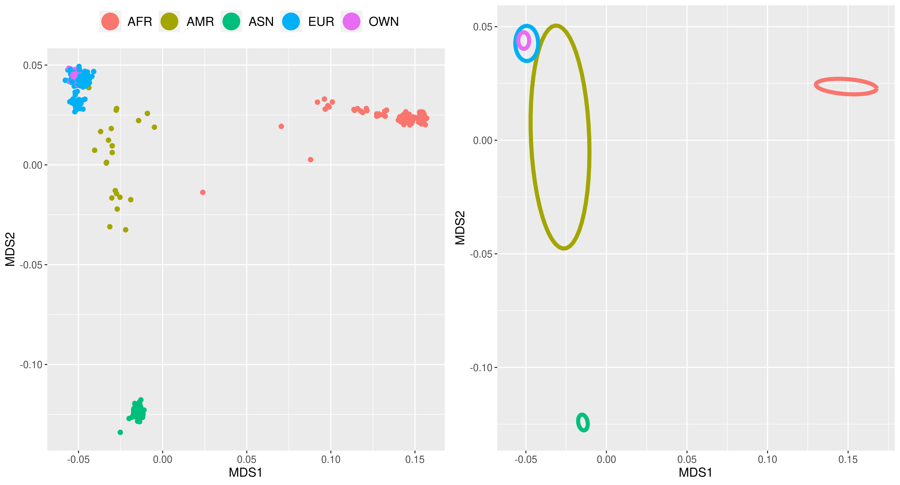
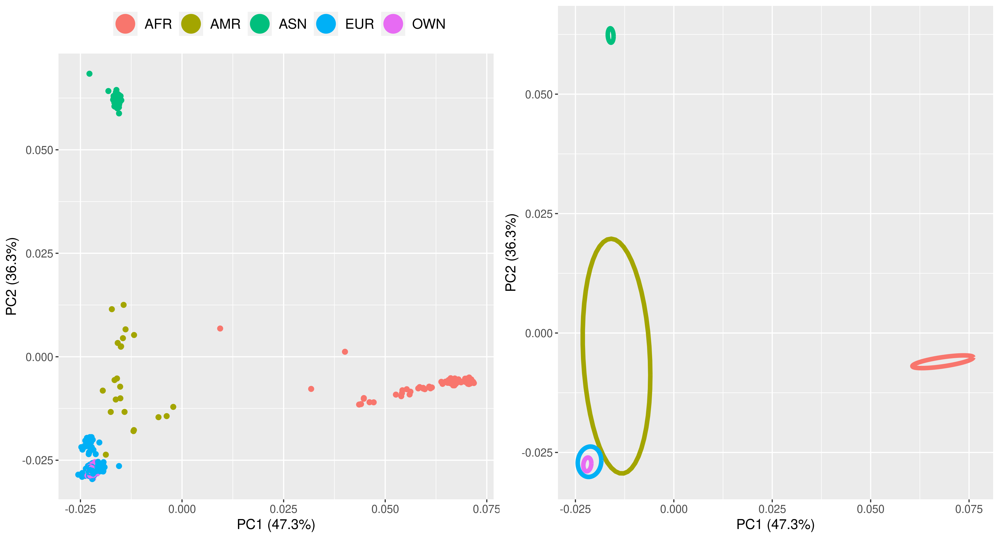

# Population Stratifacation
## Obtaining the 1000 genome reference data set


In this tutorial, you will learn how to restrict the quality-controlled HapMap data to individuals that are all of the same genetic ancestry. Most genetic research focuses on one ancestry group at the time, as mixing ancestry groups may lead to population stratification confounding the results ``reference?``. Within this reference group, we will compute clusters that can be used to correct for further confounding due to population stratification.

To construct population clusters from the HapMap data, we will need to compare genomes in this dataset to genomes from a reference panel for which ancestry is known. The reference panel we will use is from the 1000 genomes project.

Note that, while there is more updated data available from the 1000 Genomes project, we decided to use this data for 2 reasons: 
1. The most updated data set is much larger and separated by chromosome, which makes it more computationally intensive and requires an adjustment in the coding to account for the seperate chromosomes. 
2. We are able to sufficiently parse out European samples and account for population stratification using this data set. For details on how to use the most updated set see the [Separated by Chromosome](Additional_considerations.md) section on the Additional Considerations page. 

You can download using the following command:

```bash
wget ftp://ftp-trace.ncbi.nih.gov/1000genomes/ftp/release/20100804/ALL.2of4intersection.20100804.genotypes.vcf.gz
```

The data comes in a zipped vcf format. Note that the download is quite sizeable (~65GB). When working with genetic data, one regularly encounters sizable files. It is good practice to check the validity of the downloaded files, before working with them further. Sometimes, the distributor of the data will provide a hash value for the file of interest, such that you are able to check the integrity of your downloaded file. You can check the hash value for the 1000 genomes data using the Linux-command.

```bash
md5sum ALL.2of4intersection.20100804.genotypes.vcf.gz
```

which should return ``9de60b62a195455359390d4c951d92d4``. If the value for your download is not the same, your download might have been corrupted, and we advise you to download the data again.

As in tutorial 1, we use PLINK to perform analysis on this dataset. First, the data will be converted into the plink binary format (*.bim,.bed,.fam*) using plink's **--make-bed** flag. There is no need to unzip the vcf file, as plink can read and convert gzipped files directly. 

```bash 
plink --vcf ALL.2of4intersection.20100804.genotypes.vcf.gz --make-bed --out 1000genomes.genotypes
```

??? note "Inspect the resulting .fam and .bim files"

    ```bash
    head 1000genomes.genotypes.fam
    HG00098 HG00098 0 0 0 -9
    HG00100 HG00100 0 0 0 -9
    HG00106 HG00106 0 0 0 -9
    HG00112 HG00112 0 0 0 -9
    HG00114 HG00114 0 0 0 -9
    HG00116 HG00116 0 0 0 -9
    HG00117 HG00117 0 0 0 -9
    HG00118 HG00118 0 0 0 -9
    HG00119 HG00119 0 0 0 -9
    HG00120 HG00120 0 0 0 -9
    
    head 1000genomes.genotypes.bim
    1       rs112750067     0       10327   C       T
    1       rs117577454     0       10469   G       C
    1       rs55998931      0       10492   T       C
    1       rs58108140      0       10583   A       G
    1       .       0       11508   A       G
    1       .       0       11565   T       G
    1       .       0       12783   G       A
    1       .       0       13116   G       T
    1       .       0       13327   C       G
    1       .       0       13980   C       T
    ```

One thing to note from the .fam file is that sex ids are missing, plink will read these as ambiguous observations. The head of the .bim file further shows that some SNPs have no assigned rs-id. We can use plink to assign unique identifiers to these SNPs, using the **--set-missing-var-ids** flag. You are free to construct your own ids, but ensure that they are unique. We build our id using the chromosome number (@), a colon, base-pair position (#), the build (b37), the reference allele, a comma, and the alternative allele. The 1000 genomes data uses the Genome Reference Consortium Human Build 37 (GRCh37). It is important to note that if you are using a different build you will need to adjust the *[b37]* accordingly. 

```bash
plink --bfile 1000genomes.genotypes --set-missing-var-ids @:#[b37]\$1,\$2 --make-bed --out 1000genomes_nomissing.genotypes
```

??? note "Our .bim file now looks as follows:"
  
    ```bash
    head 1000genomes_nomissing.genotypes.bim
    1       rs112750067     0       10327   C       T
    1       rs117577454     0       10469   G       C
    1       rs55998931      0       10492   T       C
    1       rs58108140      0       10583   A       G
    1       1:11508[b37]A,G 0       11508   A       G
    1       1:11565[b37]G,T 0       11565   T       G
    1       1:12783[b37]A,G 0       12783   G       A
    1       1:13116[b37]G,T 0       13116   G       T
    1       1:13327[b37]C,G 0       13327   C       G
    1       1:13980[b37]C,T 0       13980   C       T
    ```

##QC on 1000 Genomes data.

Before we can use our 1000 Genomes data as our reference panel, it is important to perform quality control procedures on this dataset in a similar fashion as outlined in [Tutorial 1](QC.md). We choose the same parameters as in this tutorial for our SNP missingness threshold, individual missingness threshold, and MAF threshold.

```bash
FILE_1K=1000genomes_nomissing.genotypes
GENO=0.02
INDV=0.02
MAF=0.05

plink --bfile $FILE_1K --geno 0.2 --make-bed --out $FILE_1K.geno.temp
plink --bfile $FILE_1K.geno.temp --mind 0.2 --allow-no-sex --make-bed --out $FILE_1K.geno.mind.temp
plink --bfile $FILE_1K.geno.mind.temp --geno $GENO --make-bed --out $FILE_1K.geno
plink --bfile $FILE_1K.geno --mind $INDV --allow-no-sex --make-bed --out $FILE_1K.geno.mind

plink --bfile $FILE_1K.geno.mind --maf $MAF --make-bed --out $FILE_1K.geno.mind.maf
```
5,808,310 variants and all 629 people pass filters and QC.

**Remove variants based on MAF**
 
```bash
plink --bfile $FILE_1K.geno.mind --maf $MAF --make-bed --out $FILE_1K.geno.mind.maf
```
**Extract the variants present in our dataset from the 1000 genomes dataset**
Our reference panel and our dataset of interest (e.g. the cleaned HapMap data) must consist of the same set of SNPs. For the remainder of this tutorial, we will set the environmental variable **FILE_QC** to refer to the clean HapMap data. The *awk '{print$2}* command selects the second column of the bim file to save the rsid values in a text file. We will then use the **--extract** flag in plink to extract only the SNPs in the 1000 genomes data that are also present in the HapMap data, and vice versa.

```bash
FILE_QC=HapMap_3_r3_1.qcout
awk '{print$2}' "$FILE_QC.bim"> QCFILE_SNPs.txt
plink --bfile $FILE_1K.geno.mind.maf --extract QCFILE_SNPs.txt --make-bed --recode --out $FILE_1K.geno.mind.maf.extract
awk '{print$2}' $FILE_1K.geno.mind.maf.extract.bim > 1kG_SNPs.txt
plink --bfile $FILE_QC --extract 1kG_SNPs.txt --recode --make-bed --out $FILE_QC.extract
```

This results in 1,072,511 SNPs that both datasets have in common.

## Change build on 1000 Genomes data build to match build of HapMap data

Our next goal is to merge the HapMap data with the 1000 genomes data, such that we can compare the (unknown) population clusters of the HapMap data with the (known) population clusters in the 1000 genomes data. Before merging genetic data, however, a couple of steps need to be taken to ensure that the files align. One of these steps is to ensure that both datasets are in the same build. The 1000 genomes data uses the Genome Reference Consortium Human Build 37 (GRCh37), whereas the HapMap data uses the older build 36. This means that, for the same rsids, the base pair position will slightly differ between these two datasets. We will use the **--update-map** flag in plink to change all base pair positions in the 1000 genomes to the positions as given by the HapMap data. 

!!! note
    Most current genetic datasets use build 37 or 38. If you are working with genetic data that is not into the build of your liking, you may wish to move your dataset to another build entirely at the start of your project. Look at our [Liftover tutorial](Additional_considerations.md) to see how to move data set to another build. 

```bash 
awk '{print$2,$4}' $FILE_QC.extract.map > buildmap.txt
# buildmap.txt contains one SNP-id and physical position per line.
plink --bfile $FILE_1K.geno.mind.maf.extract --update-map buildmap.txt --make-bed --out $FILE_1K.geno.mind.maf.extract.build
```

??? note: "The resulting output:"
    
    ```bash
    PLINK v1.90b6.17 64-bit (28 Apr 2020)          www.cog-genomics.org/plink/1.9/
    (C) 2005-2020 Shaun Purcell, Christopher Chang   GNU General Public License v3
    Logging to 1000genomes_nomissing.genotypes.geno.mind.maf.extract.build.log.
    Options in effect:
    --bfile 1000genomes_nomissing.genotypes.geno.mind.maf.extract
    --make-bed
    --out 1000genomes_nomissing.genotypes.geno.mind.maf.extract.build
    --update-map buildmap.txt

    12574 MB RAM detected; reserving 6287 MB for main workspace.
    1072511 variants loaded from .bim file.
    629 people (0 males, 0 females, 629 ambiguous) loaded from .fam.
    Ambiguous sex IDs written to
    1000genomes_nomissing.genotypes.geno.mind.maf.extract.build.nosex .
    --update-map: 1072511 values updated.
    Warning: Base-pair positions are now unsorted!
    Using 1 thread (no multithreaded calculations invoked).
    Before main variant filters, 629 founders and 0 nonfounders present.
    Calculating allele frequencies... done.
    Total genotyping rate is 0.999412.
    1072511 variants and 629 people pass filters and QC.
    Note: No phenotypes present.
    --make-bed to 1000genomes_nomissing.genotypes.geno.mind.maf.extract.build.bed +
    1000genomes_nomissing.genotypes.geno.mind.maf.extract.build.bim +
    1000genomes_nomissing.genotypes.geno.mind.maf.extract.build.fam ... done.
    ```
## Merge the Map and 1000 Genomes data sets

??? note "Prior to merging 1000 Genomes data with the data we want to make sure that the files are mergeable, for this we conduct 3 steps:"

    1) Make sure the reference genome is similar in your data and the 1000 Genomes Project datasets 
    
    2) Resolve strand issues. 
    
    3) Remove the SNPs which after the previous two steps still differ between datasets


**1) set reference genome**
```bash
awk '{print$2,$5}' $FILE_1K.geno.mind.maf.extract.build.bim > 1kg_ref-list.txt
plink --bfile $FILE_QC.extract --reference-allele 1kg_ref-list.txt --make-bed --out Map-adj
# The 1kG_MDS6 and the HapMap-adj have the same reference genome for all SNPs.
```

**2) Resolve strand issues**
```bash
awk '{print$2,$5,$6}' $FILE_1K.geno.mind.maf.extract.build.bim > 1kGMDS_strand_tmp
awk '{print$2,$5,$6}' Map-adj.bim > Map-adj_tmp
sort 1kGMDS_strand_tmp Map-adj_tmp |uniq -u > all_differences.txt
```

*Flip SNPs for resolving strand issues*
```bash
awk '{print$1}' all_differences.txt | sort -u > flip_list.txt
plink --bfile Map-adj --flip flip_list.txt --reference-allele 1kg_ref-list.txt --make-bed --out corrected_map
```

*Check for SNPs which are still problematic after they have been flipped.*
```bash
awk '{print$2,$5,$6}' corrected_map.bim > corrected_map_tmp
sort 1kGMDS_strand_tmp corrected_map_tmp |uniq -u  > uncorresponding_SNPs.txt
```

**3) Remove problematic SNPs from your data and from the 1000 Genomes.**
```bash
awk '{print$1}' uncorresponding_SNPs.txt | sort -u > SNPs_for_exclusion.txt
plink --bfile corrected_map --exclude SNPs_for_exclusion.txt --make-bed --out $FILE_QC.extract.rem
plink --bfile $FILE_1K.geno.mind.maf.extract.build --exclude SNPs_for_exclusion.txt --make-bed --out $FILE_1K.geno.mind.maf.extract.build.rem
```

## Merge outdata with 1000 Genomes Data

```bash
plink --bfile $FILE_QC.extract.rem --bmerge $FILE_1K.geno.mind.maf.extract.build.rem.bed $FILE_1K.geno.mind.maf.extract.build.rem.bim $FILE_1K.geno.mind.maf.extract.build.rem.fam --allow-no-sex --make-bed --out MDS_merge2
```
## Perform MDS and PCA on Map-CEU data anchored by 1000 Genomes data using a set of pruned SNPs

**Download the file with population information of the 1000 genomes dataset.**
```bash
wget ftp://ftp-trace.ncbi.nih.gov/1000genomes/ftp/release/20100804/20100804.ALL.panel
```
*The file 20130502.ALL.panel contains population codes of the individuals of 1000 genomes.*

**Convert population codes into superpopulation codes (i.e., AFR,AMR,ASN, and EUR).**
```bash
awk '{print$1,$1,$2}' 20100804.ALL.panel > race_1kG.txt
```

**Create a racefile of your own data.**
```bash
awk '{print$1,$2,"OWN"}' $FILE_QC.extract.rem.fam > racefile_own.txt
```
**make txt file of concatenated racefiles**
```bash
sed 's/JPT/ASN/g' race_1kG.txt>race_1kG2.txt
sed 's/ASW/AFR/g' race_1kG2.txt>race_1kG3.txt
sed 's/CEU/EUR/g' race_1kG3.txt>race_1kG4.txt
sed 's/CHB/ASN/g' race_1kG4.txt>race_1kG5.txt
sed 's/CHD/ASN/g' race_1kG5.txt>race_1kG6.txt
sed 's/YRI/AFR/g' race_1kG6.txt>race_1kG7.txt
sed 's/LWK/AFR/g' race_1kG7.txt>race_1kG8.txt
sed 's/TSI/EUR/g' race_1kG8.txt>race_1kG9.txt
sed 's/MXL/AMR/g' race_1kG9.txt>race_1kG10.txt
sed 's/GBR/EUR/g' race_1kG10.txt>race_1kG11.txt
sed 's/FIN/EUR/g' race_1kG11.txt>race_1kG12.txt
sed 's/CHS/ASN/g' race_1kG12.txt>race_1kG13.txt
sed 's/PUR/AMR/g' race_1kG13.txt>race_1kG14.txt
cat race_1kG14.txt racefile_own.txt | sed -e '1i\FID IID race' > racefile.txt
```

# Perform MDS

=== "Perform MDS Clustering"
    ```bash 
    plink --bfile MDS_merge2 --extract plink.prune.in --genome --out MDS_merge2
    plink --bfile MDS_merge2 --read-genome MDS_merge2.genome --cluster --mds-plot 10 --out MDS_merge2
    ```
=== "Create MDS-plot"
    # Generate population stratification plot.
    === "Performed in R"
    
    ```{r}
    data<- read.table(file="MDS_merge2.mds",header=TRUE)
    race<- read.table(file="racefile.txt",header=TRUE)
    datafile<- merge(data,race,by=c("IID","FID"))
    head(datafile)
    
    pdf("MDS.pdf",width=7,height=7)
    for (i in 1:nrow(datafile))
    {
    if (datafile[i,14]=="EUR") {plot(datafile[i,4],datafile[i,5],type="p",xlim=c(-0.1,0.2),ylim=c(-0.15,0.1),xlab="MDS Component 1",ylab="MDS Component 2",pch=1,cex=0.5,col="green")}
    par(new=T)
    if (datafile[i,14]=="ASN") {plot(datafile[i,4],datafile[i,5],type="p",xlim=c(-0.1,0.2),ylim=c(-0.15,0.1),xlab="MDS Component 1",ylab="MDS Component 2",pch=1,cex=0.5,col="red")}
    par(new=T)
    if (datafile[i,14]=="AMR") {plot(datafile[i,4],datafile[i,5],type="p",xlim=c(-0.1,0.2),ylim=c(-0.15,0.1),xlab="MDS Component 1",ylab="MDS Component 2",pch=1,cex=0.5,col=470)}
    par(new=T)
    if (datafile[i,14]=="AFR") {plot(datafile[i,4],datafile[i,5],type="p",xlim=c(-0.1,0.2),ylim=c(-0.15,0.1),xlab="MDS Component 1",ylab="MDS Component 2",pch=1,cex=0.5,col="blue")}
    par(new=T)
    if (datafile[i,14]=="OWN") {plot(datafile[i,4],datafile[i,5],type="p",xlim=c(-0.1,0.2),ylim=c(-0.15,0.1),xlab="MDS Component 1",ylab="MDS Component 2",pch=3,cex=0.7,col="black")}
    par(new=T)
    }
    
    abline(v=-0.035,lty=3)
    abline(h=0.035,lty=3)
    legend("topright", pch=c(1,1,1,1,3),c("EUR","ASN","AMR","AFR","OWN"),col=c("green","red",470,"blue","black"),bty="o",cex=1)
    dev.off()
    ```

    

# Perform PCA 

=== "Perform PCA Clustering"
    ```bash
    plink --bfile MDS_merge2 --indep-pairwise 50 5 0.5 
    plink --bfile MDS_merge2 --extract plink.prune.in  --make-bed --pca 10 'header' --out PCA_MERGE
    ```
=== "Create PCA-plot"
    === "Performed in R"
    ```{r}
    library(dplyr)
    data<- read.table(file="PCA_MERGE.eigenvec",header=TRUE)
    eigenval<-read.table(file="PCA_MERGE.eigenval",header=F)
    race<- read.table(file="racefile.txt",header=TRUE)
    datafile<- merge(data,race,by=c("IID","FID"))
    datafile=datafile %>% filter(datafile$race %in% c("EUR","ASN","AMR","AFR","OWN"))
    head(datafile)
    pve = eigenval/sum(eigenval)*100
    library(ggplot2)
    library(gridExtra)
    png("pcagg.png",units="in",width=13,height=7,res=300)
    b <- ggplot(datafile, aes(PC1, PC2, col = race,group=race)) 
    b <- b+ geom_point(size = 2)
    b <-b + xlab(paste0("PC1 (", signif(pve[1,1],3), "%)")) + ylab(paste0("PC2 (", signif(pve[2,1], 3), "%)"))+
    theme(text = element_text(size=13),legend.text=element_text(size=13),legend.title = element_blank(),legend.position='top')+guides(color = guide_legend(override.aes = list(size=8)))
    c <-ggplot(datafile, aes(PC1, PC2, col = race,group=race)) 
    c <-c+ggplot2::stat_ellipse(
      geom = "path",
      position = "identity",
      show.legend = NA,
      size=2,
      inherit.aes = TRUE,
      type = "t",
      level = 0.95,
      segments = 51
    )
    c <- c + xlab(paste0("PC1 (", signif(pve[1,1],3), "%)")) + ylab(paste0("PC2 (", signif(pve[2,1], 3), "%)"))+
    theme(text = element_text(size=13),legend.title = element_blank(),legend.position = "none")
    grid.arrange(b, c, ncol=2)
    dev.off()
    awk '{ if ($3 <-0.005 && $4 >-0.005) print $1,$2 }' PCA_MERGE.eigenvec > EUR_samp.txt
    ```
    
## Run Admixture algorithm

!!! note

    You must install the ADMIXTURE software [here](http://dalexander.github.io/admixture/download.html). If       you are running on a conda environment you can install the admixture software using the following command:
    ```bash 
    conda install -c bioconda admixture
    ```
**Concatenate racefiles.**
```bash
awk '{print$1,$2,"-"}' $FILE_QC.extract.rem.fam > racefile_own.txt
awk '{print$1,$1,$2}' 20100804.ALL.panel > race_1kG.txt
cat racefile_own.txt race_1kG.txt| sed -e '1i\FID IID race' > MDS_merge2.pop
sed -i -e "1d" MDS_merge2.pop
cut -d " " -f 3- MDS_merge2.pop >temp.txt
```
**make popfile for admixture script**
```bash
mv temp.txt MDS_merge2.pop
```

**run admixture script**
```bash
qsub -cwd -pe smp 8 -l mem_free=32G -l scratch=100G -l h_rt=40:20:00 ad.sh
admixture --supervised ./MDS_merge2.bed 12 > log_merge_admixture.out
```

!!! warning

    This step can take a very long time. Running overnight may be neccessary. 
    
=== "Performed in R"

```{r}
R
tbl=read.table("MDS_merge2.12.Q")
popGroups = read.table("MDS_merge2.pop")
fam=read.table("MDS_merge2.fam")
mergedAdmWithPopGroups = cbind(tbl, popGroups)
ordered = mergedAdmWithPopGroups
#ceu v5
#tsi v12
#fin v2
#gbr v1
ordered$EUR=ordered$V5+ordered$V12+ordered$V2+ordered$V1
fam$race=ordered$EUR
ids1=fam$V1[which(fam$race>0.8)]
ids=data.frame(ids1)
ids$ids2=fam$V2[which(fam$race>0.8)]
##list of europeans to extract from files
write.table(ids,'europeans.txt',quote = FALSE,row.names = FALSE,col.names=FALSE)
ordered$V5=c()
ordered$V12=c()
ordered$V2=c()
ordered$V1=c()
ordered=ordered[order(-ordered$EUR),]
#barplot(t(as.matrix(subset(ordered, select=c("YRI","ASW","CHB","CHS","EUR","JPT","LWK","MXL","PUR")))), col=rainbow(12), border=NA,names.arg=popnew, las=2,cex.names=0.1)
pdf('admixture.pdf')
barplot(t(as.matrix(subset(ordered, select=c("V3" , "V4" , "V6" , "V7"  ,"V8"  ,"V9" ,"V10", "V11","EUR")))), col=rainbow(9), border=NA, las=2,ylab="Percent Pop",xaxt="n",xlab='<---- Direction of more European')
dev.off()
```

> An example bar plot generated using script in `admixtureplot.R` 

The output of this script prints out a text file **europeans.txt** with a list of all the individuals that are found to be 80% or more European. 


## Exclude ethnic outliers.
*Select individuals in your own data below cut-off thresholds. The cut-off levels are not fixed thresholds but have to be determined based on the visualization of the first two dimensions. To exclude ethnic outliers, the thresholds need to be set around the cluster of population of interest.*

```bash
awk '{ if ($4 <-0.04 && $5 >0.03) print $1,$2 }' MDS_merge2.mds > EUR_MDS_merge2
plink --bfile $FILE_QC --keep EUR_MDS_merge2 --make-bed --out $FILE_QC.euro
```
*to exclude ethnic outliers using output from ADMIXTURE use the following script*
```bash
plink --bfile $FILE_QC --keep europeans.txt --make-bed --out $FILE_QC.euro
```

## Hardy Weinburg equilibrium filter on controls


```bash
HWE_CONTROL=1e-6
plink --bfile $FILE_QC.euro --hwe $HWE_CONTROL --make-bed --out $FILE_QC.euro.hwe_control
```

## Filter founders from dataset 
This excludes all samples with at least one known parental ID in the current analysis
```bash
plink --bfile $FILE_QC.euro.hwe_control --filter-founders --make-bed --out $FILE_QC.euro.hwe_control.found
```

## Check for cryptic relatedness with plink2
Use KING method (implemented in Plink2) to filter out individuals that are more closely related than third cousins. 

```bash 
plink2 --bfile $FILE_QC.euro.hwe_control.found --make-king-table --king-table-filter 0.0884
sed 's/^#//' plink2.kin0 > kin.txt
```
Assess missingness so you can remove individual with most missingness in each pair

```bash 
plink --bfile $FILE_QC.euro.hwe_control.found --missing
```
In R, run the following script to remove the individuals with the highest amount of missingness in each related pair. 
```
=== "Performed in R"

```{r}
data<- read.table(file="kin.txt",header=TRUE)
data_related=data[,c(1,2,3,4)]
missing <- read.table("plink.imiss", header =TRUE, as.is=T)
FID1=data_related[,c(1,2)]
FID2=data_related[,c(3,4)]

FID1$index=row.names(FID1)
FID2$index=row.names(FID2)

FID1$IID=FID1$IID1
FID2$IID=FID2$IID2

FID1[,1:2]=c()
FID2[,1:2]=c()

FID1=merge(FID1,missing,by="IID")
FID2=merge(FID2,missing,by="IID")

FID1[,4:6]=c()
FID2[,4:6]=c()

FID1$index=as.numeric(FID1$index)
FID2$index=as.numeric(FID2$index)

q=c(setdiff(FID2$index, FID1$index), setdiff(FID1$index, FID2$index))
if (length(q) != 0) {
FID1=FID1[!(FID1$index==q),]
FID2=FID2[!(FID2$index==q),]
}

FID1=FID1[order(FID1[,2]),]
FID2=FID2[order(FID2[,2]),]

##this binds the FIDs,IIDs,missingness for all pairs
bind=cbind(FID1,FID2)
bind$index=c()
bind$index=c()
##this displays just the values for missingness for each pair
bindval=cbind(FID1$F_MISS,FID2$F_MISS)
colnames(bindval)=c(1,2)
max=as.numeric(colnames(bindval)[apply(bindval,1,which.max)])

#finds the corresponding IID and FID (bind1 and bind2) for the individual with the higher missingness so it can be removed
bind1=bind[cbind(seq_along(max*3-1), max*3-1)]
bind2=bind[cbind(seq_along(max*3-2), max*3-2)]
final=cbind(bind1,bind2)
final=unique(final)
write.table(final, 'low_call_rate.txt', append = FALSE, sep = " ", dec = ".",
            row.names = FALSE, col.names = FALSE,quote=FALSE)
```           

**remove individual with higher missingness**
```bash
plink --bfile $FILE_QC.euro.hwe_control.found --remove low_call_rate.txt --make-bed --out $FILE_QC.euro.hwe_control.found.unrelated
```
## Create covariates based on MDS.
*Perform an MDS ONLY on qccase data without ethnic outliers. The values of the 10 MDS dimensions are subsequently used as covariates in the association analysis in the third tutorial*
```bash	
plink --bfile $FILE_QC.euro.hwe_control.found.unrelated --extract plink.prune.in --genome --out $FILE_QC.euro.hwe_control.found.unrelated
plink --bfile $FILE_QC.euro.hwe_control.found.unrelated --read-genome $FILE_QC.euro.hwe_control.found.unrelated.genome --cluster --mds-plot 10 --out $FILE_QC.euro.hwe_control.found.unrelated.MDS
awk '{print$1, $2, $4, $5, $6, $7,$8,$9,$10,$11,$12,$13}' $FILE_QC.euro.hwe_control.found.unrelated.MDS.mds > covar_mds.txt
```
**The values in covar_mds.txt will be used as covariates, to adjust for remaining population stratification, in the third tutorial where we will perform a genome-wide association analysis.**

```bash
mv $FILE_QC.euro.hwe_control.found.unrelated.bed ./popstratout.bed
mv $FILE_QC.euro.hwe_control.found.unrelated.bim ./popstratout.bim
mv $FILE_QC.euro.hwe_control.found.unrelated.fam ./popstratout.fam
cp popstratout* ../3_Association_GWAS
cp covar_mds.txt ../3_Association_GWAS
cd ../3_Association_GWAS
```


